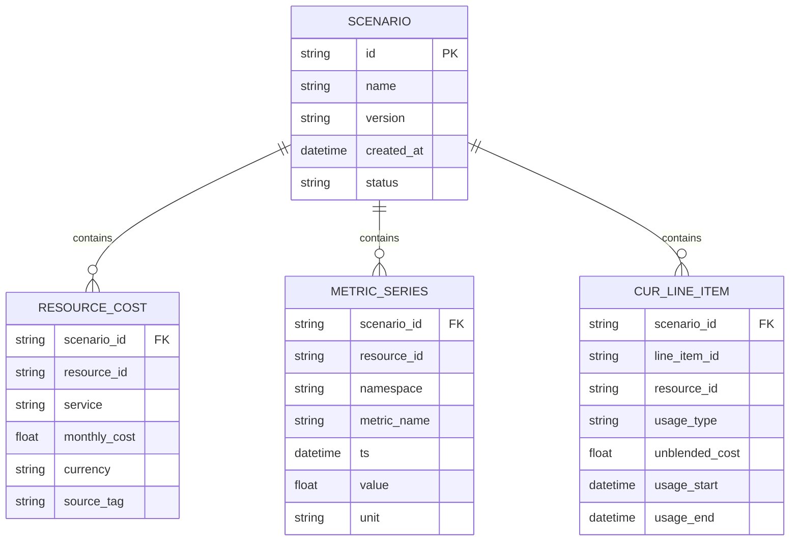

# feat: Add standalone cost/CUR/metrics simulation service with adapter-based AWS switching

> Archived note (2026-02-20): The planned `aws-cost-data-service` was removed in favor of direct runtime integration with `aws-mock-data-service`.

## Overview

Design and introduce a **separate service** dedicated to cost and metrics data sourcing/simulation, so the existing backend no longer owns mock billing logic directly.

The new service will expose a stable internal API for:
- resource-level cost lookup,
- CUR-backed query responses,
- CloudWatch-like metric series.

It will support swappable adapters (`mock`, `aws`, and optional `hybrid`) through configuration only, so switching from simulated data to real AWS becomes an environment/profile change rather than a code rewrite.

## Problem Statement

Current cost/metrics behavior is fragmented and partially hardcoded in the main backend:

- Real Cost Explorer integration is explicitly TODO:
  - `graph_builder.py:1023`
- Cost enrichment currently runs only in LocalStack mode:
  - `orchestrator_tools_core.py:677`
- Cost baseline logic uses approximate estimators (not billing truth):
  - `cost_estimation.py:4`
- LocalStack CE mock data is persisted/read from local files:
  - `setup_localstack.py:495`
  - `graph_builder.py:980`
- CloudWatch metrics are partially real in graph-building, but still include LocalStack-specific heuristics:
  - `graph_builder.py:1136`

This makes the system hard to evolve toward production-grade billing parity and creates coupling between scan logic and data-source implementation details.

## Goals

- Keep mock/real cost and metrics sourcing **outside** the existing backend service boundary.
- Support easy runtime switching between mock and real AWS using config.
- Preserve existing downstream contract in the optimization backend (`monthly_cost`, `usage_metrics`) to minimize orchestrator churn.
- Provide deterministic scenario control for tests/CI.
- Keep extension path open for higher-fidelity CUR/Athena workflows.

## Non-Goals

- Full 1:1 emulation of every AWS Billing/Cost API behavior in v1.
- Replacing all existing LocalStack usage in one cutover.
- UI redesign as part of this work.

## Brainstorm Context

No relevant brainstorm document found in `docs/brainstorms/` for this feature domain within the recent 14-day window.

## Local Research Summary

### Repository patterns

- Orchestrator depends on graph-derived `get_metrics` and `get_costs` primitives:
  - `orchestrator_tools_primitives.py:217`
  - `orchestrator_tools_primitives.py:264`
- Graph builder already centralizes enrichment steps, making it a clean integration seam:
  - `graph_builder.py:975`
  - `graph_builder.py:1033`
- Mock data generation already exists as scripts and can seed a separate service dataset:
  - `scripts/generate_cur_data.py:1`
  - `scripts/generate_cloudwatch_metrics.py:1`
  - `Makefile:53`
  - `Makefile:64`

### Institutional learnings

No direct prior solution in `docs/solutions/` for billing/metrics adapter architecture was found.

Cross-cutting lesson to carry forward:
- enforce explicit invariants and deterministic behavior for async state transitions and cache lifecycles to avoid race/regression issues in downstream flows.

## Research Decision

External research is required and was performed.

Reason:
- This is an external API integration topic with data correctness impact and substantial emulator/coverage tradeoffs.

## External Research Findings

### Key constraints

- LocalStack Cost Explorer currently cannot query real aggregated cost/usage totals:
  - [LocalStack CE limitations](https://docs.localstack.cloud/aws/services/ce/)
- LocalStack CloudWatch supports many flows but has known metric limitations (for example anomaly detection/metric streams):
  - [LocalStack CloudWatch limitations](https://docs.localstack.cloud/aws/services/cloudwatch/)
- Moto supports CE/CW/Athena partially, but CE/Athena query outputs are queue-seeded (not computed from tracked billing truth):
  - [Moto CE](https://docs.getmoto.org/en/latest/docs/services/ce.html)
  - [Moto CloudWatch](https://docs.getmoto.org/en/latest/docs/services/cloudwatch.html)
  - [Moto Athena](https://docs.getmoto.org/en/latest/docs/services/athena.html)
  - [Moto service index](https://docs.getmoto.org/en/latest/docs/services/index.html)
- AWS CUR API manages report definitions; CUR analytics typically flow via S3 + Athena:
  - [CUR API operations](https://docs.aws.amazon.com/aws-cost-management/latest/APIReference/API_Operations_AWS_Cost_and_Usage_Report_Service.html)
  - [CUR with Athena](https://docs.aws.amazon.com/cur/latest/userguide/cur-query-athena.html)
  - [What CUR provides](https://docs.aws.amazon.com/cur/latest/userguide/what-is-cur.html)
- Cost Explorer API is the simpler real-source path for aggregated usage/cost queries:
  - [CE API usage](https://docs.aws.amazon.com/cost-management/latest/userguide/ce-api.html)

Inference from sources: no single OSS tool provides high-fidelity, production-parity emulation for CE + CUR + CloudWatch simultaneously. A composable adapter architecture is lower-risk than betting on one emulator.

## SpecFlow Analysis

### Primary user flows

1. **Local development (mock mode)**
- Engineer runs cost-data service in `mock` mode.
- Existing backend requests resource costs and metrics over internal API.
- Agent output stays deterministic and test-friendly.

2. **CI regression (scenario mode)**
- CI seeds scenario dataset (`baseline`, `spike`, `idle-heavy`).
- Contract tests verify backend outputs and risk scoring consistency.

3. **Staging/prod (aws mode)**
- Service runs AWS adapters (CE + CloudWatch; CUR/Athena optional).
- Backend keeps same internal calls and payload contract.

4. **Hybrid fallback mode**
- Service attempts real adapter first.
- Missing fields/services fall back to mock profile with explicit source tags.

### Edge cases

- Real adapter throttling or partial outages.
- CUR delay and late-arriving line items.
- Resource IDs present in graph but absent from CE/CUR response windows.
- Cross-account or multi-region request expansion.
- Drift between mock profile assumptions and real AWS billing patterns.

## Proposed Solution

Create a new deployable service: `aws-cost-data-service`.

### 1) Service boundary and responsibilities

The new service owns:
- cost sourcing (mock/CE/CUR adapters),
- metrics sourcing (mock/CloudWatch adapters),
- scenario dataset lifecycle,
- source provenance tagging and fallback semantics.

The existing backend owns:
- graph construction and finding logic,
- orchestration and execution flows,
- UI/API endpoints already in place.

### 2) Internal API contract (stable, provider-agnostic)

Proposed endpoints:
- `POST /v1/cost/resource-monthly`
- `POST /v1/cost/timeseries`
- `POST /v1/metrics/resource-series`
- `POST /v1/cur/query` (bounded query templates in v1)
- `GET /v1/health`
- `GET /v1/capabilities`

Admin/test endpoints (non-prod):
- `POST /admin/scenarios/load`
- `PATCH /admin/scenarios/resource-cost/{resource_id}`
- `POST /admin/scenarios/reset`

### 3) Adapter model

Provider selection via env/profile (service-local):
- `COST_PROVIDER=mock|aws|hybrid`
- `CUR_PROVIDER=mock|athena|hybrid`
- `METRICS_PROVIDER=mock|cloudwatch|hybrid`

Adapter interfaces (pseudocode):

```python
# aws-cost-data-service/app/providers/interfaces.py
class CostProvider(Protocol):
    async def get_resource_monthly_costs(self, resource_ids: list[str], window: str) -> list[ResourceCost]: ...

class CurProvider(Protocol):
    async def run_query(self, query_template: str, params: dict) -> CurQueryResult: ...

class MetricsProvider(Protocol):
    async def get_resource_metrics(self, resource_id: str, metrics: list[str], window: str) -> MetricSeriesResult: ...
```

### 4) Data fidelity strategy

- **v1 mock fidelity:** deterministic and scenario-driven, not full AWS wire parity.
- **v2 wire compatibility (optional):** add AWS-like compatibility routes only for needed API subsets.
- Track source provenance in every response:
  - `source=mock|ce|cur|cloudwatch`
  - `freshness_timestamp`
  - `fallback_applied=true|false`

### 5) Integration into existing backend (minimal touch)

Replace file-based and direct provider-specific branching with service client calls at enrichment seams:
- `graph_builder.py` cost enrichment path
- `graph_builder.py` metrics enrichment path

Keep current field outputs unchanged for downstream tooling:
- `node.monthly_cost`
- `node.usage_metrics[...]`

### 6) Storage model for scenarios and fixtures

Support both:
- file-based fixture packs (JSON/Parquet)
- optional lightweight metadata DB for scenario cataloging

ERD (if DB-backed catalog is enabled):



## Technical Approach

### Architecture

- Deploy as a separate process/container with independent lifecycle.
- Prefer separate repo ownership; acceptable fallback is strict workspace boundary with separate deployment unit.
- Existing backend communicates over HTTP client with timeout/retry/circuit-breaker.
- No shared mutable state between backend and cost-data service.

### Implementation Phases

#### Phase 1: Service foundation (mock-first)

Deliverables:
- New service scaffold, internal API, provider interfaces, scenario loader.
- Mock adapters backed by fixture packs and seeded generators.
- Capability endpoint and provenance fields.

Tasks:
- [x] Create service skeleton in `services/aws-cost-data-service/app/main.py`.
- [x] Implement contracts in `services/aws-cost-data-service/app/schemas/contracts.py`.
- [x] Implement mock adapters in `services/aws-cost-data-service/app/providers/mock_*.py`.
- [x] Add scenario admin endpoints in `services/aws-cost-data-service/app/routes/admin.py`.
- [x] Add fixture layout and seed tooling in `services/aws-cost-data-service/data/`.

#### Phase 2: Real AWS adapters

Deliverables:
- CE adapter for aggregated/resource-supported cost calls.
- CloudWatch adapter for metric series.
- CUR/Athena adapter for configured query templates.

Tasks:
- [ ] Add CE adapter in `services/aws-cost-data-service/app/providers/aws_ce.py`.
- [ ] Add CloudWatch adapter in `services/aws-cost-data-service/app/providers/aws_cloudwatch.py`.
- [ ] Add CUR/Athena adapter in `services/aws-cost-data-service/app/providers/aws_athena_cur.py`.
- [ ] Add IAM permission matrix docs in `services/aws-cost-data-service/docs/iam.md`.

#### Phase 3: Backend integration and migration

Deliverables:
- Existing backend consumes service endpoints instead of local file mock paths.
- Feature flag for progressive cutover.

Tasks:
- [ ] Add client in `aws-optimize-agent/integrations/cost_data_service_client.py`.
- [ ] Wire graph enrichment callsites in `aws-optimize-agent/graph_builder.py`.
- [ ] Add config toggles in `aws-optimize-agent/.env.example` and startup config.
- [ ] Keep legacy paths behind temporary fallback flag for rollback.

#### Phase 4: Quality gates and rollout

Deliverables:
- Contract tests, parity checks, load and failure-mode tests.
- Runbook and dashboards.

Tasks:
- [ ] Contract tests in `services/aws-cost-data-service/tests/contract/`.
- [ ] Mock-vs-aws parity suite in `services/aws-cost-data-service/tests/parity/`.
- [ ] Integration tests in `aws-optimize-agent/tests/integration/test_cost_data_service_client.py`.
- [ ] Rollout checklist in `services/aws-cost-data-service/docs/rollout.md`.

## Alternative Approaches Considered

### A) Keep logic inside current backend

Pros:
- fastest short-term edits.

Cons:
- increases coupling and branching complexity,
- harder independent scaling/versioning,
- directly conflicts with the “do not tangle with existing backend” constraint.

Decision: reject.

### B) Full AWS API mimic service as first release

Pros:
- strongest drop-in AWS shape compatibility.

Cons:
- large scope and ongoing emulation burden.

Decision: defer; consider limited compatibility routes after internal contract stabilizes.

### C) LocalStack/Moto only, no custom service

Pros:
- less custom code.

Cons:
- documented feature gaps for CE/CUR fidelity and cost truth workflows.

Decision: use as complementary test tooling, not as architecture core.

## Acceptance Criteria

### Functional

- [ ] Cost, CUR query, and metrics retrieval are served by a dedicated standalone service.
- [ ] Existing backend can switch data source mode via config only.
- [ ] Mock scenario data can be updated without backend code changes.
- [ ] Source provenance is returned per response and persisted in logs.

### Non-Functional

- [ ] P95 response time under agreed local target for batched resource requests.
- [ ] Service failure does not crash orchestrator scan; fallback behavior is explicit.
- [ ] Contract tests pass for mock and aws adapter modes.

### Quality Gates

- [ ] Integration tests cover graph enrichment path after service migration.
- [ ] Parity tests validate normalized output stability across adapters.
- [ ] Docs include setup, IAM, runbook, and rollback toggles.

## Success Metrics

- Switch from `mock` to `aws` mode achieved by config/profile change only.
- Reduction in direct mock-file branching in core backend enrichment code.
- Deterministic CI scenarios reproducible via scenario seed/profile.
- No regression in finding generation precision on existing e2e suite baseline.

## Dependencies & Prerequisites

- Runtime:
  - service deployment target (container/local),
  - network path from backend to new service,
  - secrets management for AWS credentials in real mode.
- IAM (real mode):
  - CE query permissions,
  - CloudWatch read permissions,
  - Athena/S3/Glue permissions for CUR query path.

## Risk Analysis & Mitigation

- Risk: adapter drift produces inconsistent outputs.
  - Mitigation: normalized contracts + parity tests + provenance tags.

- Risk: CUR freshness lag mismatches with near-real-time expectations.
  - Mitigation: freshness metadata and explicit UI/backend warnings.

- Risk: added service operational overhead.
  - Mitigation: minimal API surface, clear health checks, simple deployment profile.

- Risk: partial AWS coverage causes silent gaps.
  - Mitigation: `capabilities` endpoint and strict fallback logging.

## Resource Requirements

- Engineering: backend platform engineer + one integration/testing owner.
- Infra: one additional container/service deployment unit.
- Tooling: contract test harness and seed-data management.

## Documentation Plan

- New docs:
  - `services/aws-cost-data-service/README.md`
  - `services/aws-cost-data-service/docs/api-contract.md`
  - `services/aws-cost-data-service/docs/iam.md`
  - `services/aws-cost-data-service/docs/operations.md`
- Existing docs updates:
  - root `README.md` integration section,
  - backend config references for provider switches,
  - testing workflow for scenario seeding.

## References & Research

### Internal references

- `graph_builder.py:975`
- `graph_builder.py:1023`
- `graph_builder.py:1033`
- `graph_builder.py:1136`
- `orchestrator_tools_core.py:677`
- `orchestrator_tools_primitives.py:217`
- `orchestrator_tools_primitives.py:264`
- `setup_localstack.py:495`
- `scripts/generate_cur_data.py:1`
- `scripts/generate_cloudwatch_metrics.py:1`
- `Makefile:53`
- `Makefile:64`

### External references

- AWS Cost Explorer API: [Using the AWS Cost Explorer API](https://docs.aws.amazon.com/cost-management/latest/userguide/ce-api.html)
- AWS CUR API operations: [AWS Cost and Usage Report API ops](https://docs.aws.amazon.com/aws-cost-management/latest/APIReference/API_Operations_AWS_Cost_and_Usage_Report_Service.html)
- AWS CUR fundamentals: [What are AWS CUR](https://docs.aws.amazon.com/cur/latest/userguide/what-is-cur.html)
- CUR with Athena: [Querying CUR using Athena](https://docs.aws.amazon.com/cur/latest/userguide/cur-query-athena.html)
- LocalStack CE limitations: [LocalStack Cost Explorer](https://docs.localstack.cloud/aws/services/ce/)
- LocalStack CloudWatch limitations: [LocalStack CloudWatch](https://docs.localstack.cloud/aws/services/cloudwatch/)
- Moto service coverage index: [Moto implemented services](https://docs.getmoto.org/en/latest/docs/services/index.html)
- Moto CE behavior: [Moto CE](https://docs.getmoto.org/en/latest/docs/services/ce.html)
- Moto CloudWatch behavior: [Moto CloudWatch](https://docs.getmoto.org/en/latest/docs/services/cloudwatch.html)
- Moto Athena behavior: [Moto Athena](https://docs.getmoto.org/en/latest/docs/services/athena.html)
- Mockoon CE sample: [Mockoon AWS CE sample](https://mockoon.com/mock-samples/amazonawscom-ce/)
- Mockoon CUR sample: [Mockoon AWS CUR sample](https://mockoon.com/mock-samples/amazonawscom-cur/)
