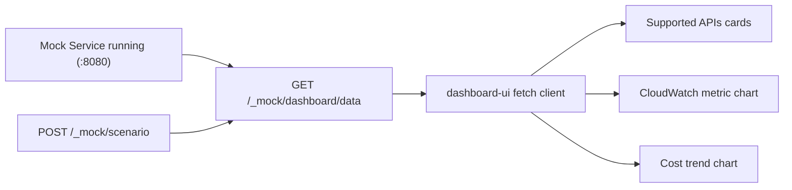

# feat: Add simple web dashboard for supported AWS mock APIs

## Overview
Add a simple web dashboard UI that shows:
- all currently supported mock APIs,
- live summary counters (resources, metrics, cost rows),
- metric/cost graphs sourced from the mock service data.

The goal is fast visual verification of mock API behavior and dataset health, without running manual CLI checks first.

## Brainstorm Context
Found brainstorm from 2026-02-18: `aws-mock-data-service-rust-cli`. Using as context for planning.

Key decisions reused:
- Keep AWS wire protocol fidelity as source-of-truth.
- Keep LocalStack + Rust mock service as the local parity stack.
- Preserve deterministic/testing-friendly behavior (time offsets, scenario switching).

## Problem Statement / Motivation
Today we have strong contract tests and CLI matrices, but no lightweight visual surface for quickly validating:
- what APIs are implemented now,
- whether data is populated and fresh,
- how metric/cost trends look over time for supported operations.

This creates unnecessary friction for debugging and demos.

## Research Consolidation

### Local Repo Findings
- Mock service currently exposes only root AWS handler + two admin endpoints: `services/aws-mock-data-service/src/serve.rs:25`.
- Existing admin status endpoint already returns key counts (`resource_count`, `metric_count`): `services/aws-mock-data-service/src/serve.rs:27`.
- Metric data retrieval uses `metrics::query_metrics` with dynamic `seconds_from_now` logic: `services/aws-mock-data-service/src/metrics.rs:23`.
- Schema already supports graph-friendly series (`metrics`, `cost_records`): `services/aws-mock-data-service/migrations/20260218120000_initial_schema.sql:11`.
- Current tested/supported API inventory is documented and updated: `docs/testing/aws-mock-api-coverage-status.md:10`.
- We already have chart primitives in the existing React UI stack (`recharts` wrappers): `dashboard-ui/src/components/ui/chart.tsx:1`.
- Dashboard UI app has no proxy configured yet for mock service calls: `dashboard-ui/vite.config.ts:61`.

### Institutional Learnings
- Relevant learning: `docs/solutions/integration-issues/high-fidelity-aws-mocking-rust-service.md`.
- Important carry-forward: preserve protocol compatibility and deterministic time-window behavior while adding observability surfaces.

### External Research Decision
This work is tied to external AWS API contracts and local emulation behavior, so external docs were reviewed.

### External References
- CloudWatch `GetMetricData`: https://docs.aws.amazon.com/AmazonCloudWatch/latest/APIReference/API_GetMetricData.html
- CloudWatch `GetMetricStatistics`: https://docs.aws.amazon.com/AmazonCloudWatch/latest/APIReference/API_GetMetricStatistics.html
- Cost Explorer `GetCostAndUsage`: https://docs.aws.amazon.com/aws-cost-management/latest/APIReference/API_GetCostAndUsage.html
- Vite server proxy (for local cross-port UI calls): https://vite.dev/config/server-options
- Axum static file serving (`ServeDir`): https://docs.rs/tower-http/latest/tower_http/services/struct.ServeDir.html

## Proposed Solution

### High-Level Approach
Implement a two-part, minimal architecture:

1. **Backend dashboard data endpoint(s) in Rust mock service**
- Add read-only endpoint(s) under `/_mock/dashboard/*` to return:
  - supported API inventory (from server constants),
  - summary counters (`resources`, `metrics`, `cost_records`),
  - time-series for CloudWatch and cost data.

2. **Simple frontend dashboard in `dashboard-ui`**
- Add a focused page/component to render:
  - supported API cards,
  - line chart(s) for metric series,
  - bar/line chart for daily cost trend,
  - last refresh timestamp and empty-state diagnostics.

### Why This Approach
- Reuses existing React + Recharts stack (no new frontend framework).
- Keeps source-of-truth metrics in the Rust service (no duplicated query logic in UI).
- Keeps testability high with contract-style endpoint assertions.

## Technical Approach

### Backend Changes (Rust Mock Service)
- Add `services/aws-mock-data-service/src/handlers/dashboard.rs`
  - `GET /_mock/dashboard/data` response schema:
    - `supported_apis[]`
    - `summary` (counts)
    - `cloudwatch_series[]`
    - `cost_series[]`
    - `generated_at`
  - Query data from `metrics` + `cost_records` via SQLx and existing time-offset logic.
- Update `services/aws-mock-data-service/src/handlers/mod.rs`
  - Register `dashboard` module.
- Update `services/aws-mock-data-service/src/serve.rs`
  - Route `GET /_mock/dashboard/data`.
  - Optional: route `GET /_mock/dashboard` if serving a static preview HTML from Rust is preferred.

### Frontend Changes (`dashboard-ui`)
- Add `dashboard-ui/src/lib/api-mock-dashboard.ts`
  - Typed fetch client for `/_mock/dashboard/data`.
- Add `dashboard-ui/src/components/MockApiDashboard.tsx`
  - Render:
    - Supported API list (CloudWatch + Cost Explorer + admin endpoints),
    - metric chart (CPU utilization or selected metric),
    - daily cost chart,
    - status cards and empty/error states.
- Update `dashboard-ui/src/App.tsx`
  - Add an entry point toggle/view for the dashboard.
- Update `dashboard-ui/vite.config.ts`
  - Add dev proxy for mock service endpoint (for local no-CORS workflow).

### Testing Changes
- Add backend integration tests:
  - `tests/integration/test_mock_dashboard_contract.py`
  - Validate status codes, response shape, and non-crashing empty dataset behavior.
- Add frontend component tests:
  - `dashboard-ui/src/components/__tests__/MockApiDashboard.test.tsx`
  - Validate rendering for: success payload, loading, empty data, and error fallback.
- Optional smoke command:
  - Add `make test-mock-dashboard` to run targeted backend + frontend tests.

### Documentation Changes
- Update `docs/testing/aws-mock-api-coverage-status.md`
  - Add dashboard endpoint status and scope.
- Update `docs/testing/aws-cli-parity-command-matrix.md`
  - Add quick `curl` check for `/_mock/dashboard/data`.

## SpecFlow Analysis

### User Flow
1. Developer runs `make setup-mock` and `make serve` for mock service.
2. Developer opens dashboard UI.
3. UI fetches `/_mock/dashboard/data`.
4. UI renders supported API cards and metric/cost graphs.
5. Developer switches scenario (`Spike`/`Baseline`) and refreshes.
6. Graphs and summary update accordingly.

### Flow Diagram

### Edge Cases to Cover
- Empty database (no resources/metrics/cost rows).
- Unsupported/unknown metric namespace requests for chart filters.
- Large dataset response size (chart rendering + payload limits).
- Service unavailable/timeouts.
- Scenario switch during active polling refresh.

## Stakeholder Analysis
- **Developers:** faster feedback loop than manual CLI-only checks.
- **Operations/Test maintainers:** easier visual triage for data drift and setup failures.
- **End users/internal reviewers:** easier demoability and confidence in supported API surface.
- **Security/compliance:** dashboard remains read-only; admin write endpoint usage stays explicit.

## Dependencies & Risks

### Dependencies
- Running mock service (`services/aws-mock-data-service`).
- Existing `dashboard-ui` toolchain and Recharts components.

### Risks
- Cross-origin issues between `dashboard-ui` and mock service ports.
- Payload growth if series are unbounded.
- Confusion between “supported API” and “implemented but not yet parity-expanded API”.

### Mitigations
- Use Vite proxy for local development.
- Server-side time-window limit for dashboard series.
- Display explicit “supported now” vs “planned next” sections.

## Implementation Phases

### Phase 1: Backend Dashboard Data Contract
- [x] Define dashboard JSON schema in `services/aws-mock-data-service/src/serve.rs`.
- [x] Add `/_mock/dashboard/data` route in `services/aws-mock-data-service/src/serve.rs`.
- [x] Add SQLx queries for summary + chart series from `metrics` and `cost_records`.
- [x] Add backend contract tests in `tests/integration/test_mock_dashboard_contract.py`.

### Phase 2: Frontend Dashboard UI
- [x] Add `dashboard-ui/src/lib/api-mock-dashboard.ts` data client.
- [x] Add `dashboard-ui/src/components/MockApiDashboard.tsx` with API cards + graphs.
- [x] Wire dashboard view into `dashboard-ui/src/App.tsx`.
- [x] Configure mock API proxy in `dashboard-ui/vite.config.ts`.
- [x] Add UI tests in `dashboard-ui/src/components/__tests__/MockApiDashboard.test.tsx`.

### Phase 3: Hardening and Docs
- [x] Add loading/error/empty-state UX and refresh controls.
- [x] Add/verify simple performance guardrails for chart windowing.
- [x] Update `docs/testing/aws-mock-api-coverage-status.md`.
- [x] Update `docs/testing/aws-cli-parity-command-matrix.md`.

## Acceptance Criteria
- [x] Dashboard shows currently supported APIs from mock service contract.
- [x] Dashboard renders at least one CloudWatch trend graph and one Cost Explorer trend graph.
- [x] Dashboard works after scenario changes and reflects data updates.
- [x] Empty dataset state is handled without crashes.
- [x] Backend contract tests and frontend tests pass.
- [x] Local run instructions are documented and reproducible.

## Success Metrics
- Dashboard first meaningful render < 2s in local dev baseline.
- Zero uncaught exceptions in dashboard load path.
- 100% pass rate for new dashboard contract + component tests.
- Reduced manual parity-debug cycle time (target: < 2 minutes to visual confirmation).

## Alternative Approaches Considered
- **Standalone static dashboard served directly by Rust only**
  - Pros: no Node runtime needed.
  - Cons: duplicates UI primitives and increases JS-in-Rust maintenance.
- **CLI-only parity with no UI**
  - Pros: minimal implementation.
  - Cons: slower triage and weaker demo/debug ergonomics.

## References & Related Work
- Existing parity plan: `docs/plans/2026-02-19-test-comprehensive-aws-api-parity-suite-plan.md`
- API support baseline: `docs/testing/aws-mock-api-coverage-status.md`
- CLI matrix baseline: `docs/testing/aws-cli-parity-command-matrix.md`
- Mock service router: `services/aws-mock-data-service/src/serve.rs:24`
- Metric query core: `services/aws-mock-data-service/src/metrics.rs:23`
- Chart primitives: `dashboard-ui/src/components/ui/chart.tsx:1`
