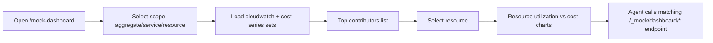

# feat: Add resource-level trend analytics for waste investigation in mock dashboard

## Overview
Expand the mock dashboard from single account-level trend lines to investigation-grade analytics:
- service-level trend breakdowns,
- per-resource trend lines,
- top waste contributors,
- API-first endpoints that agents can query directly.

This enables concrete waste triage (which resources are driving cost/low-utilization), not just health visualization.

## Brainstorm Context
Found brainstorm from 2026-02-18: `aws-mock-data-service-rust-cli`. Using as context for planning.

Key decisions reused:
- Keep wire-protocol fidelity and deterministic generated datasets.
- Keep Rust mock service as the source-of-truth for analytics payloads.
- Keep dashboard as a read-only observability/investigation surface.

## Problem Statement / Motivation
Current charts answer only: “What is the overall trend?”
They do not answer:
- which resources are waste candidates,
- which services contribute most to cost growth,
- whether a specific resource’s utilization and cost are diverging.

Without resource-level trends, neither human reviewers nor the agent can use the dashboard as an actionable waste investigation tool.

## Research Consolidation

### Local Repo Findings
- Dashboard endpoint currently returns one aggregated CloudWatch series and one aggregated cost series: `services/aws-mock-data-service/src/serve.rs:383` and `services/aws-mock-data-service/src/serve.rs:409`.
- Metrics and costs already store `resource_id`, enabling per-resource grouping: `services/aws-mock-data-service/migrations/20260218120000_initial_schema.sql:10`.
- Generator emits multiple namespaces/metrics per resource type (EC2/RDS/S3/ELB), so richer breakdowns are possible now: `services/aws-mock-data-service/src/generator.rs:264`.
- Frontend dashboard currently binds a single CloudWatch and single cost chart: `dashboard-ui/src/components/MockApiDashboard.tsx:291` and `dashboard-ui/src/components/MockApiDashboard.tsx:330`.
- Existing dashboard contract tests validate shape/core APIs and can be extended for multi-series payloads: `tests/integration/test_mock_dashboard_contract.py:11`.

### Institutional Learnings
- For dense UI telemetry layouts, prioritize explicit regioning and robust responsive behavior with targeted tests: `docs/solutions/ui-bugs/monitor-right-edge-clipping-assistant-20260215.md`.
- Keep protocol-compatible backend behavior and deterministic time modeling as non-negotiable: `docs/solutions/integration-issues/high-fidelity-aws-mocking-rust-service.md`.

### External Research Decision
This feature touches external AWS API semantics used for parity and future shadow comparisons, so external documentation was reviewed.

### External References
- CloudWatch `GetMetricData` (multi-query, pagination, metric math): https://docs.aws.amazon.com/AmazonCloudWatch/latest/APIReference/API_GetMetricData.html
- CloudWatch `MetricDataQuery` structure: https://docs.aws.amazon.com/AmazonCloudWatch/latest/APIReference/API_MetricDataQuery.html
- Cost Explorer `GetCostAndUsage`: https://docs.aws.amazon.com/aws-cost-management/latest/APIReference/API_GetCostAndUsage.html
- Cost Explorer `GetCostAndUsageWithResources` (resource-level semantics/constraints): https://docs.aws.amazon.com/aws-cost-management/latest/APIReference/API_GetCostAndUsageWithResources.html

## Proposed Solution

### High-Level Approach
1. Extend backend dashboard data model to return **series sets** (not only single aggregate lines).
2. Add queryable investigation endpoints for agent/human workflows.
3. Add dashboard controls (service/resource selectors, top-N contributors, split charts).
4. Add parity benchmark/scorecard for investigation coverage (implemented + tested cases).

### Agent-Native Requirement
Every investigation view shown in UI must have an equivalent API call so the agent can perform the same analysis without UI interaction.

## Technical Approach

### Backend Contract Evolution
Extend `GET /_mock/dashboard/data` and/or add focused endpoints:

- `GET /_mock/dashboard/data`
  - Add optional query params:
    - `scope=aggregate|service|resource`
    - `resource_type=ec2|rds|s3|elb|all`
    - `resource_id=<id>`
    - `namespace=<aws namespace>`
    - `metric_name=<metric>`
    - `top_n=<int>`
    - `window_hours=<int>`
  - Add payload blocks:
    - `cloudwatch_series_sets[]` (label + points)
    - `cost_series_sets[]` (label + points)
    - `top_cost_resources[]`
    - `top_low_utilization_resources[]` (heuristic from metrics)

- Optional focused endpoints (preferred for agent ergonomics):
  - `GET /_mock/dashboard/resources`
  - `GET /_mock/dashboard/trends/cloudwatch`
  - `GET /_mock/dashboard/trends/cost`
  - `GET /_mock/dashboard/investigation/summary`

### Backend Query Model
- Use SQL groupings by:
  - `resource_id`,
  - `resources.resource_type`,
  - `metrics.namespace`, `metrics.metric_name`,
  - time buckets from `seconds_from_now`.
- Join `metrics` and `cost_records` with `resources` metadata for labels/tags.
- Keep deterministic timestamp conversion using current mock “now” conventions.

### Frontend Dashboard UX
Enhance `dashboard-ui/src/components/MockApiDashboard.tsx` with:
- scope selector (`aggregate`, `service`, `resource`),
- service/resource filters,
- top contributors list (click to pin resource chart),
- multi-line trend chart for selected breakdown,
- side-by-side “Utilization vs Cost” resource view.

### Benchmark / Scorecard Definition
Add a dashboard investigation benchmark artifact (JSON) with:
- `investigation_scope_coverage` (aggregate/service/resource supported),
- `resource_filter_coverage` (resource_id and resource_type filters),
- `metric_dimension_coverage` (namespace+metric combinations supported),
- `contract_test_coverage` (required cases implemented),
- `agent_query_parity` (all UI actions have API equivalents).

## SpecFlow Analysis

### Key User/Agent Flows
1. Open dashboard and switch to `service` scope.
2. Identify service with highest rising cost.
3. Switch to `resource` scope for that service.
4. Select top resource and compare utilization vs cost trend.
5. Export/call equivalent API payload for agent investigation.

### Flow Diagram

### Edge Cases
- Empty dataset for selected filter.
- Selected resource missing one of metric/cost series.
- Large account with top-N cardinality pressure.
- Conflicting filters (resource_id outside selected service).
- Scenario changes while filtered resource is selected.

## Stakeholder Analysis
- **Developers:** can quickly isolate waste-driving resources without CLI loops.
- **Agent runtime:** gains API-level primitives for deterministic waste investigation.
- **Operations:** better demo/debug for optimization recommendations.
- **Business:** improves confidence that recommendations map to specific cost drivers.

## Implementation Phases

### Phase 1: Backend Data Contract for Investigation
- [x] Define v2 dashboard schema in `services/aws-mock-data-service/src/serve.rs` for multi-series output.
- [x] Add SQL aggregations for service/resource trend sets.
- [x] Add top contributors blocks (`top_cost_resources`, low-utilization candidates).
- [x] Add/extend endpoints under `/_mock/dashboard/*` for filterable queries.

### Phase 2: Frontend Investigation UX
- [x] Extend typed client in `dashboard-ui/src/lib/api-mock-dashboard.ts` for new filters and series-set payloads.
- [x] Add scope/filter controls in `dashboard-ui/src/components/MockApiDashboard.tsx`.
- [x] Render multi-line charts and resource compare panel.
- [x] Add top contributor interactions (click to focus resource).

### Phase 3: Parity Benchmark + Testing
- [x] Add backend contract tests for scope/filter combinations in `tests/integration/test_mock_dashboard_contract.py`.
- [x] Add frontend tests for filter behavior and resource selection in `dashboard-ui/src/components/__tests__/MockApiDashboard.test.tsx`.
- [x] Add CLI matrix checks for new dashboard investigation endpoints in `docs/testing/aws-cli-parity-command-matrix.md`.
- [x] Add/update investigation scorecard artifact and docs in `docs/testing/aws-mock-api-coverage-status.md`.

## Acceptance Criteria
- [x] Dashboard supports `aggregate`, `service`, and `resource` trend scopes.
- [x] Users can identify top waste contributors and drill down to a specific resource chart.
- [x] For selected resource, utilization and cost trends are viewable together.
- [x] Every dashboard drilldown action has an equivalent API call (agent parity).
- [x] Contract + UI tests cover filter edge cases and pass reliably.

## Success Metrics
- Time-to-identify top waste resource from dashboard: < 60 seconds in local dataset.
- 100% of dashboard investigation controls map to documented API endpoints.
- No blank/ambiguous chart states without explicit fallback guidance.
- Benchmark scorecard includes investigation coverage dimensions and is reproducible.

## Dependencies & Risks

### Dependencies
- `services/aws-mock-data-service` schema and endpoint compatibility.
- Existing dashboard UI chart primitives and test harness.

### Risks
- Payload bloat with many series.
- UI clutter from excessive lines/labels.
- Drift between UI controls and API capabilities.

### Mitigations
- Top-N default limits and server-side capping.
- Progressive disclosure (scope first, then detail).
- API-first contract docs + parity tests per control.

## AI-Era Considerations
- Add explicit prompts/examples for agent investigation calls in docs.
- Require human review on any heuristic “low utilization” thresholding logic.
- Keep rapid implementation guarded by deterministic contract tests.

## References & Related Work
- `docs/plans/2026-02-19-feat-mock-api-metrics-dashboard-ui-plan.md`
- `docs/plans/2026-02-19-fix-mock-dashboard-chart-rendering-and-coverage-visibility-plan.md`
- `services/aws-mock-data-service/src/serve.rs`
- `services/aws-mock-data-service/src/generator.rs`
- `dashboard-ui/src/components/MockApiDashboard.tsx`
- `docs/testing/aws-mock-api-coverage-status.md`
