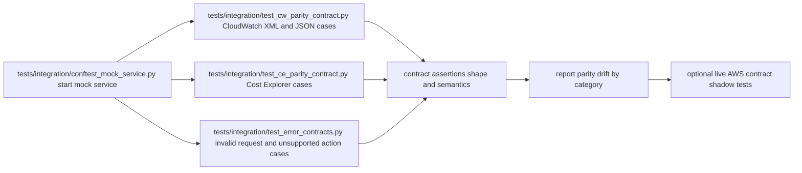

# test: Comprehensive AWS API parity suite for mock services

## Enhancement Summary

**Deepened on:** 2026-02-19  
**Sections enhanced:** 4  
**Research agents/inputs used:** repo references, existing parity fixtures, botocore inventory artifacts, AWS API references already linked in this plan.

### Key Improvements
1. Added a detailed next-API expansion backlog with concrete contract scope per API.
2. Added implementation touchpoints and test matrix expectations for each prioritized API.
3. Added rollout sequence and explicit benchmark impact mapping for expansion work.

### New Considerations Discovered
- Cost Explorer expansion should start with operations that improve both query realism (`GetDimensionValues`) and forecast realism (`GetCostForecast`) before recommendation APIs.
- Pagination parity closure (`GetMetricData` `NextToken`) is a prerequisite to avoid false confidence in downstream coverage gates.

## Overview
Build a comprehensive, repeatable parity test suite that validates `services/aws-mock-data-service` behavior against real AWS API contracts for CloudWatch and Cost Explorer, with deterministic local execution, explicit coverage benchmarks, and optional live AWS conformance runs.

## Brainstorm Context
Found brainstorm from 2026-02-18: `aws-mock-data-service-rust-cli`. Using it as planning context.

Key carry-forwards:
- Rust mock service is the parity bridge for LocalStack gaps.
- API wire-level fidelity is the primary success criterion.
- Dynamic time-offset behavior must remain testable and deterministic.

## Problem Statement
Current tests establish basic behavior but do not yet provide exhaustive parity guarantees for request validation, response schema fidelity, pagination semantics, protocol-specific edge cases, and concurrency/load behavior at production-like request shapes.

## Research Consolidation

### Internal Repo Findings
- Existing parity tests are limited in breadth and rely on assumptions that may not match AWS contracts: `tests/integration/test_cw_parity.py:16`, `tests/integration/test_ce_parity.py:16`.
- Robustness tests exist but do not yet cover broad contract permutations: `tests/integration/test_robustness_concurrency.py:17`.
- Cost Explorer currently supports `GetCostAndUsage` only, with simplified grouped output behavior: `services/aws-mock-data-service/src/serve.rs:330`.
- CloudWatch Query protocol currently supports two actions (`GetMetricStatistics`, `GetMetricData`) and rejects others as unsupported: `services/aws-mock-data-service/src/serve.rs:428`.
- Scenario switching now mutates backing data and is testable as a contract surface: `services/aws-mock-data-service/src/serve.rs:301`, `services/aws-mock-data-service/src/generator.rs:220`.
- Request routing and validation logic are centralized and provide a stable extraction point for operation inventory and error behavior tests: `services/aws-mock-data-service/src/serve.rs:253`, `services/aws-mock-data-service/src/serve.rs:322`, `services/aws-mock-data-service/src/serve.rs:565`.
- Dynamic time-offset querying is implemented in `metrics::query_metrics`, which is the core behavior to benchmark for time-window parity: `services/aws-mock-data-service/src/metrics.rs:23`.

### Institutional Learnings
- Relevant learning: `docs/solutions/integration-issues/high-fidelity-aws-mocking-rust-service.md`.
- Key insight: parity work must treat protocol routing, error envelopes, WAL-backed concurrency, and dynamic time windows as first-class invariants.
- Critical patterns file was not found at `docs/solutions/patterns/critical-patterns.md` (no additional cross-cutting pattern overrides discovered).

### External Research Decision
This feature targets external AWS APIs directly, so external research is required.

### Deprecation/Sunset Check (Mandatory)
Checked for CloudWatch `GetMetricData` / `GetMetricStatistics` and Cost Explorer `GetCostAndUsage` deprecation/sunset notices.
- No deprecation or shutdown found for these specific operations in official AWS API references (as of 2026-02-19).
- Unrelated service deprecations exist in AWS ecosystem; parity scope remains valid for selected operations.

### External Documentation Highlights
- CloudWatch `GetMetricData` includes strong request limits and pagination semantics (`NextToken`, `MaxDatapoints`, query count limits) that should be explicitly tested.
- CloudWatch `GetMetricStatistics` returns up to 1,440 datapoints per call and has period/retention constraints.
- Cost Explorer `GetCostAndUsage` contract includes `Granularity`, `Metrics`, `GroupBy`, `Filter`, and `NextPageToken` behaviors; parity tests must include both positive and invalid combinations.
- Pytest guidance supports parameterized contract matrices, per-case marks (`xfail`, `skipif`), and runtime skip when integration dependencies are unavailable.
- Botocore service models (`service-2.json`, `paginators-1.json`) provide machine-readable operation/input/output/error contracts and should be treated as the benchmark source-of-truth for contract inventory.

## Scope

### In Scope
- Exhaustive parity tests for CloudWatch Query/XML + CloudWatch JSON + Cost Explorer JSON.
- Request validation parity (required fields, invalid formats, invalid enums, unsupported actions).
- Response shape parity (field presence, types, casing, timestamp/value structures, error envelopes).
- Pagination and boundary behavior tests.
- Deterministic scenario/time-window test coverage.
- Concurrency and robustness parity tests for read-heavy and mixed workloads.

### Out of Scope
- Implementing entirely new AWS operations in service handlers.
- Full SigV4 cryptographic validation (local-mode bypass remains intentional).
- UI/browser-level tests.

## SpecFlow Analysis

### User Flow Overview
1. Developer seeds mock data and starts mock server.
2. Test runner issues SDK/HTTP requests to mock endpoint.
3. Responses are validated against AWS contract expectations.
4. Failures are categorized as protocol, schema, validation, or behavior drift.
5. Optional live AWS parity mode compares canonicalized outputs.

### Flow Diagram

### Flow Permutations Matrix

| Dimension | Variants |
|---|---|
| Protocol | CloudWatch Query/XML, CloudWatch JSON, Cost Explorer JSON |
| Caller | boto3 client, raw HTTP client |
| Input Quality | valid, malformed, boundary, unsupported action |
| Dataset State | baseline, spike, idle-heavy, empty-ish resource result |
| Time Context | normal now, injected now via header, boundary windows |
| Execution Mode | local deterministic, optional live AWS shadow |
| Runtime Conditions | single-threaded, concurrent read, mixed read/write |

### Missing Elements and Gaps Identified
- Missing exhaustive negative matrix for required/optional parameters.
- Missing explicit pagination token parity checks.
- Missing contract assertions for sorted/unsorted timestamp semantics where AWS is permissive.
- Missing standardized canonicalization layer for optional live AWS comparisons.
- Missing resilience classification for transient transport failures vs contract mismatches.

### Critical Clarification Questions
1. Critical: Should optional live AWS parity tests run in CI nightly or be manual-only by default?
Assumption if unanswered: manual-only with explicit env toggle.
2. Important: Do we treat exact message text as strict parity, or only code + shape?
Assumption if unanswered: strict error code and shape, tolerant message text matching.
3. Important: Is unsupported action behavior expected as operation-specific error code or generic unsupported action?
Assumption if unanswered: keep operation-specific assertions loose, require 4xx + AWS envelope.

## Technical Approach

### Test Architecture
- Add contract-focused suites:
  - `tests/integration/test_cw_parity_contract.py`
  - `tests/integration/test_ce_parity_contract.py`
  - `tests/integration/test_error_contracts.py`
  - `tests/integration/test_pagination_contracts.py`
  - `tests/integration/test_time_window_contracts.py`
- Keep current smoke-style parity tests as fast confidence layer.
- Introduce shared helpers:
  - `tests/integration/helpers/aws_contract_assertions.py`
  - `tests/integration/helpers/normalizers.py`
  - `tests/integration/helpers/mock_service_runner.py`

### Contract Fixture Strategy
- Add deterministic request/expectation fixtures:
  - `tests/integration/fixtures/aws_parity/cloudwatch_get_metric_data_cases.json`
  - `tests/integration/fixtures/aws_parity/cloudwatch_get_metric_statistics_cases.json`
  - `tests/integration/fixtures/aws_parity/cost_explorer_get_cost_and_usage_cases.json`
- Represent each case with:
  - request payload
  - expected status
  - expected envelope shape
  - semantic assertions (ranges, ordering, counts)

### Optional Live AWS Shadow Mode
- Gate with env vars (example):
  - `AWS_PARITY_LIVE=1`
  - `AWS_PARITY_ACCOUNT_ID`
  - `AWS_PARITY_REGION`
- Canonicalize responses before comparison:
  - ignore request IDs and dates
  - normalize timestamp formatting
  - compare structural invariants and constrained value behaviors

## Parity Benchmark Framework

### Contract Source of Truth
- Primary contract source: botocore service models for `cloudwatch` and `ce` (operations, input/output shapes, modeled errors, paginator models).
- Secondary validation source: AWS API Reference for operation semantics and documented limits.
- Runtime reality source: optional live AWS shadow calls for selected gold cases.

### Operation Inventory and Coverage Universe
- Build a generated inventory artifact for each target service and API version:
  - `tests/integration/fixtures/aws_parity/inventory/cloudwatch-2010-08-01.json`
  - `tests/integration/fixtures/aws_parity/inventory/ce-2017-10-25.json`
- Each operation entry records:
  - operation name
  - input required members
  - input optional members
  - output top-level members
  - modeled errors
  - paginator token members (if present)
- Explicit targeted set for this phase:
  - CloudWatch: `GetMetricData`, `GetMetricStatistics`
  - Cost Explorer: `GetCostAndUsage`

### Benchmark Dimensions and Scoring
- `operation_coverage`:
  - formula: `tested_target_operations / target_operations`
  - gate: `>= 1.00`
- `input_member_coverage`:
  - formula: `asserted_input_members / total_target_input_members`
  - gate: `>= 0.95`
- `output_member_coverage`:
  - formula: `asserted_output_members / total_target_output_members`
  - gate: `>= 0.95`
- `error_model_coverage`:
  - formula: `tested_modeled_error_classes / modeled_error_classes_relevant_to_implementation`
  - gate: `>= 0.90`
- `behavioral_coverage`:
  - dimensions: pagination, boundary windows, malformed inputs, unsupported actions, deterministic clock behavior, concurrency
  - gate: all dimensions must have at least one passing contract case per operation
- `live_shadow_parity` (optional/nightly):
  - formula: `matching_live_cases / executed_live_cases`
  - gate: `>= 0.95` with failure triage labels (`contract-drift`, `mock-bug`, `data-shape-delta`)

### Benchmark Artifacts
- `tests/integration/reports/parity_scorecard.json`
- `tests/integration/reports/parity_scorecard.md`
- `tests/integration/reports/live_shadow_diff.json` (only when live mode enabled)

### Benchmark Ownership and Drift Control
- Pin botocore version in parity tooling to avoid accidental benchmark drift.
- Add a scheduled job that refreshes inventory from current botocore and opens a parity-drift issue when operation shapes change.
- Require scorecard diff in PRs touching:
  - `services/aws-mock-data-service/src/serve.rs`
  - `services/aws-mock-data-service/src/metrics.rs`
  - `tests/integration/fixtures/aws_parity/*`

## Next API Expansion Backlog (Detailed)

### Scope Definition
This section deepens the "what next" expansion beyond current implemented operations (`GetMetricData`, `GetMetricStatistics`, `GetCostAndUsage`) by defining:
- minimal v1 contract scope (request + response + errors),
- implementation touchpoints in the Rust mock service,
- required parity tests and benchmark effects.

### Priority 0 (Immediate)

#### 1. CloudWatch `GetMetricData` pagination parity completion

**Why now**
- Existing parity suite has an explicit `xfail` for output token behavior.
- Pagination semantics are foundational for all large-result parity confidence.

**v1 Contract Scope**
- Request: support `MaxDatapoints`, `NextToken` input with deterministic paging behavior.
- Response: emit `NextToken` when results are truncated; omit when complete.
- Errors: preserve AWS-style envelope on malformed tokens (`InvalidNextToken`-style handling tolerance).

**Implementation Touchpoints**
- `services/aws-mock-data-service/src/serve.rs`
- `services/aws-mock-data-service/src/metrics.rs`
- `tests/integration/test_pagination_contracts.py`
- `tests/integration/fixtures/aws_parity/cloudwatch_get_metric_data_cases.json`

**Test Matrix**
- `MaxDatapoints` small enough to force truncation.
- stable page traversal (page 1 + token => page 2 with no overlap drift).
- invalid token path returns 4xx envelope with CloudWatch-compatible shape.

**Benchmark Impact**
- closes `xfail`.
- increases output member coverage (`NextToken`), behavioral coverage, and error model coverage.

#### 2. Cost Explorer `GetCostForecast`

**Why now**
- FinOps workflows need forward-looking signals, not only historical cost.

**v1 Contract Scope**
- Request (minimum): `TimePeriod`, `Metric`, `Granularity`.
- Optional request in v1.1: `Filter`, `PredictionIntervalLevel`.
- Response (minimum): forecast bucket list + aggregate amount/unit envelope.
- Errors: validation for malformed time ranges and unsupported metric/granularity combinations.

**Implementation Touchpoints**
- `services/aws-mock-data-service/src/serve.rs` (target dispatch + handler)
- new/extended CE handler module if split from `serve.rs`
- `tests/integration/test_ce_parity_contract.py`
- `tests/integration/fixtures/aws_parity/cost_explorer_get_cost_forecast_cases.json`
- inventory artifact refresh: `tests/integration/fixtures/aws_parity/inventory/ce-2017-10-25.json`

**Test Matrix**
- daily vs monthly forecast granularity.
- short-window and multi-period windows.
- invalid date/value paths with AWS-style validation errors.

**Benchmark Impact**
- expands operation coverage target set and raises input/output member coverage denominator and numerator.

#### 3. Cost Explorer `GetDimensionValues`

**Why now**
- Improves realism for `GroupBy`/`Filter` use in `GetCostAndUsage`.
- Enables deterministic "discover then query" workflows in tests.

**v1 Contract Scope**
- Request (minimum): `TimePeriod`, `Dimension`.
- Optional in v1.1: `Context`, `Filter`, `SearchString`, `SortBy`, `NextPageToken`.
- Response: `DimensionValues` list + optional paging token.
- Errors: invalid dimension/context handling.

**Implementation Touchpoints**
- `services/aws-mock-data-service/src/serve.rs` dispatch
- CE data/query helper module for deriving dimension values from seeded dataset
- `tests/integration/test_ce_parity_contract.py`
- `tests/integration/test_pagination_contracts.py`
- fixture file: `tests/integration/fixtures/aws_parity/cost_explorer_get_dimension_values_cases.json`

**Test Matrix**
- SERVICE dimension discovery with and without filter.
- pagination token roundtrip.
- invalid dimension code path.

**Benchmark Impact**
- improves input/output coverage depth and pagination behavioral coverage in CE domain.

### Priority 1 (High Value FinOps Intelligence)

#### 4. Cost Explorer `GetRightsizingRecommendation`

**v1 Scope**
- simulate core fields for EC2 rightsizing recommendations with conservative deterministic output.
- support key filter knobs without full AWS recommendation complexity.

**Tests**
- minimal valid request.
- unsupported recommendation target / invalid filter paths.
- stable deterministic response for same seed/time.

#### 5. Cost Explorer `GetReservationCoverage` + `GetReservationUtilization`

**v1 Scope**
- modeled coverage/utilization percentages from seeded commitment metadata.
- scoped to key grouping dimensions and date windows.

**Tests**
- baseline daily/monthly windows.
- grouped/un-grouped responses.
- edge path: empty commitment dataset.

#### 6. Cost Explorer `GetSavingsPlansCoverage` + `GetSavingsPlansUtilization`

**v1 Scope**
- same pattern as reservation metrics with savings-plan-specific envelopes.
- deterministic synthetic coverage/utilization.

**Tests**
- shared matrix with reservation APIs to avoid drift and duplication.

### Priority 2 (Broader Observability and Cost Ops)

#### 7. Cost Explorer anomalies APIs
- `GetAnomalies`, `GetAnomalyMonitors`, `GetAnomalySubscriptions`.

**v1 Scope**
- read-focused anomaly listing and monitor/subscription retrieval for test workflows.
- start with retrieval APIs before create/update lifecycle semantics.

#### 8. CloudWatch `ListMetrics`

**v1 Scope**
- deterministic metric catalog from seeded metrics table.
- support namespace + metric name + dimension filters with pagination.

**Value**
- complements `GetMetricData` by enabling realistic discovery-first workflow parity.

### Rollout Sequence and Dependencies

1. Close CloudWatch `GetMetricData` pagination output parity (`NextToken`) first.
2. Add `GetCostForecast`.
3. Add `GetDimensionValues`.
4. Add recommendation/commitment APIs (`GetRightsizingRecommendation`, reservation, savings plans).
5. Add anomaly retrieval APIs and `ListMetrics`.

Dependency rule:
- Any API introducing pagination must include request+response token parity tests in the same PR.
- Any API added to dispatch must add fixture coverage and inventory refresh in the same PR.

## Implementation Phases

### Phase 1: Foundation and Harness
- [x] Create `tests/integration/helpers/mock_service_runner.py` for lifecycle control.
- [x] Create fixture loader in `tests/integration/helpers/aws_contract_assertions.py`.
- [x] Add `tests/integration/conftest_mock_service.py` for common fixtures/markers.
- [x] Add marker strategy in `pytest.ini` for `parity_contract` and `parity_live`.
- [x] Add `tests/integration/helpers/contract_inventory.py` to extract operation/member/error inventory from botocore.
- [x] Add `tests/integration/fixtures/aws_parity/inventory/` generated inventory files.

### Phase 2: CloudWatch Contract Coverage
- [x] Implement Query/XML contract suite in `tests/integration/test_cw_parity_contract.py`.
- [x] Add invalid/missing parameter matrix in `tests/integration/test_error_contracts.py`.
- [x] Add pagination and max datapoint cases in `tests/integration/test_pagination_contracts.py`.
- [x] Add scenario/time-shift cases in `tests/integration/test_time_window_contracts.py`.

### Phase 3: Cost Explorer Contract Coverage
- [x] Implement `GetCostAndUsage` matrix in `tests/integration/test_ce_parity_contract.py`.
- [x] Cover `GroupBy`, `Filter`, granularity transitions, and invalid shape cases.
- [x] Add `NextPageToken` behavior validation in `tests/integration/test_pagination_contracts.py`.

### Phase 4: Robustness and Concurrency
- [ ] Expand `tests/integration/test_robustness_concurrency.py` for mixed read/write + high fan-out request sets.
- [ ] Add classification for transient failures vs deterministic contract mismatch.
- [ ] Add repeatability checks (same seed + same injected time => stable assertions).

### Phase 5: Live AWS Shadow and Reporting
- [x] Add optional live shadow tests in `tests/integration/test_parity_live_shadow.py`.
- [x] Add contract drift summary output in `tests/integration/helpers/normalizers.py`.
- [x] Add benchmark scorecard generator in `tests/integration/helpers/parity_scorecard.py`.
- [ ] Document runbooks in `docs/plans/` and test comments for triage paths.

### Phase 6: Governance and CI Gates
- [ ] Add CI job `parity-contract` to enforce local benchmark gates.
- [ ] Add nightly job `parity-live-shadow` (manual fallback) for AWS oracle checks.
- [ ] Add failure labeling and output retention for parity drift triage.

### Phase 7: Next API Expansion (Detailed Backlog Execution)
- [x] Implement CloudWatch `GetMetricData` output token parity and un-xfail pagination output test.
- [ ] Implement CE `GetCostForecast` with contract fixtures and parity tests.
- [ ] Implement CE `GetDimensionValues` with pagination + filter contract tests.
- [ ] Implement CE rightsizing + reservation/savings-plan utilization/coverage APIs (v1 synthetic contract).
- [ ] Implement CE anomaly retrieval APIs and CloudWatch `ListMetrics` parity path.

## Alternative Approaches Considered
- Stub-only contract tests with no runtime server: rejected, insufficient wire-level confidence.
- Golden-response-only snapshots: rejected, brittle against benign timestamp/request-id variation.
- Continuous live AWS parity in default CI: rejected for cost/credentials/flakiness risk.

## Acceptance Criteria

### Functional Requirements
- [x] Contract suites cover CloudWatch Query/XML + CloudWatch JSON + CE JSON positive and negative matrices.
- [x] Unsupported actions return AWS-style error envelopes with expected status classes.
- [x] Pagination and boundary tests validate token/limit semantics for supported operations.
- [x] Scenario switching and injected clock behavior are verified by deterministic assertions.
- [x] Inventory extraction produces reproducible operation/input/output/error universe for targeted operations.
- [x] Benchmark scorecard is generated on every parity-contract run.

### Non-Functional Requirements
- [x] Contract suite runtime for local mode <= 8 minutes on developer machine baseline.
- [ ] Flake rate <= 1% across 20 repeated local runs.
- [ ] Concurrency tests show zero DB lock failures under defined hammer profile.
- [x] Scorecard generation overhead <= 30 seconds.

### Quality Gates
- [x] New tests are namespaced and marker-tagged (`parity_contract`, `parity_live`).
- [x] Tests include skip guidance for unavailable dependencies.
- [ ] Test output includes clear mismatch diagnostics (field path + expected vs actual).
- [x] `operation_coverage == 1.00` for targeted operations.
- [x] `input_member_coverage >= 0.95`, `output_member_coverage >= 0.95`.
- [x] `error_model_coverage >= 0.90`.

## Success Metrics
- Increase parity case count from current baseline to >= 150 discrete assertions.
- Reduce unresolved parity regressions in PR review to zero for covered operations.
- Ensure every new handler change includes contract test updates in the same PR.
- Keep scorecard trend stable or improving over rolling 30 days.

## Dependencies and Prerequisites
- Running mock service and deterministic seed dataset.
- Python virtualenv with boto3/pytest/requests.
- Python virtualenv with pinned botocore for inventory generation.
- Optional AWS credentials for live shadow mode.
- Stable local clock handling for time-window tests.

## Risks and Mitigations
- Risk: Overfitting to mock implementation instead of AWS contract.
  Mitigation: fixture design anchored to official AWS docs + optional live shadow checks.
- Risk: Test flakiness from time-dependent behavior.
  Mitigation: forced `x-mock-now` in deterministic suites.
- Risk: CI cost and secrets exposure in live mode.
  Mitigation: keep live mode opt-in/nightly only.
- Risk: Contract benchmark drift when botocore models update.
  Mitigation: explicit inventory refresh workflow plus reviewed scorecard diffs.

## AI-Era Considerations
- Keep test generation human-reviewed for contract correctness.
- Track which assertions were AI-assisted vs manually validated in PR notes.
- Prefer semantic assertions over opaque generated snapshots.

## Documentation Plan
- Update `AGENTS.md` test command references for parity suites.
- Add short section in `README.md` for contract vs live parity modes.
- Add fixture schema comment block in each new fixture file.
- Add `docs/testing/aws-parity-benchmark.md` with benchmark definitions and formulas.

## References and Research

### Internal References
- `docs/brainstorms/2026-02-18-aws-mock-data-service-rust-cli-brainstorm.md`
- `docs/plans/2026-02-18-feat-aws-mock-data-service-rust-cli-plan.md`
- `docs/plans/2026-02-18-test-aws-mock-service-parity-plan.md`
- `docs/solutions/integration-issues/high-fidelity-aws-mocking-rust-service.md`
- `tests/integration/test_cw_parity.py:16`
- `tests/integration/test_ce_parity.py:16`
- `tests/integration/test_robustness_concurrency.py:17`
- `services/aws-mock-data-service/src/serve.rs:322`

### External References
- CloudWatch `GetMetricData` API: https://docs.aws.amazon.com/AmazonCloudWatch/latest/APIReference/API_GetMetricData.html
- CloudWatch `GetMetricStatistics` API: https://docs.aws.amazon.com/AmazonCloudWatch/latest/APIReference/API_GetMetricStatistics.html
- Cost Explorer `GetCostAndUsage` API: https://docs.aws.amazon.com/aws-cost-management/latest/APIReference/API_GetCostAndUsage.html
- Cost Explorer `GetCostForecast` API: https://docs.aws.amazon.com/aws-cost-management/latest/APIReference/API_GetCostForecast.html
- Cost Explorer `GetDimensionValues` API: https://docs.aws.amazon.com/aws-cost-management/latest/APIReference/API_GetDimensionValues.html
- Cost Explorer `GetRightsizingRecommendation` API: https://docs.aws.amazon.com/aws-cost-management/latest/APIReference/API_GetRightsizingRecommendation.html
- Cost Explorer `GetReservationCoverage` API: https://docs.aws.amazon.com/aws-cost-management/latest/APIReference/API_GetReservationCoverage.html
- Cost Explorer `GetReservationUtilization` API: https://docs.aws.amazon.com/aws-cost-management/latest/APIReference/API_GetReservationUtilization.html
- Cost Explorer `GetSavingsPlansCoverage` API: https://docs.aws.amazon.com/aws-cost-management/latest/APIReference/API_GetSavingsPlansCoverage.html
- Cost Explorer `GetSavingsPlansUtilization` API: https://docs.aws.amazon.com/aws-cost-management/latest/APIReference/API_GetSavingsPlansUtilization.html
- Cost Explorer `GetAnomalies` API: https://docs.aws.amazon.com/aws-cost-management/latest/APIReference/API_GetAnomalies.html
- CloudWatch API error semantics: https://docs.aws.amazon.com/AmazonCloudWatch/latest/APIReference/CommonErrors.html
- CloudWatch `ListMetrics` API: https://docs.aws.amazon.com/AmazonCloudWatch/latest/APIReference/API_ListMetrics.html
- Botocore loaders and model layout: https://botocore.amazonaws.com/v1/documentation/api/latest/reference/loaders.html
- Boto3 CloudWatch usage guide: https://boto3.amazonaws.com/v1/documentation/api/latest/guide/cw-example-metrics.html
- Pytest parametrize examples: https://docs.pytest.org/en/stable/example/parametrize.html
- Pytest skip/xfail guidance: https://docs.pytest.org/en/stable/how-to/skipping.html
