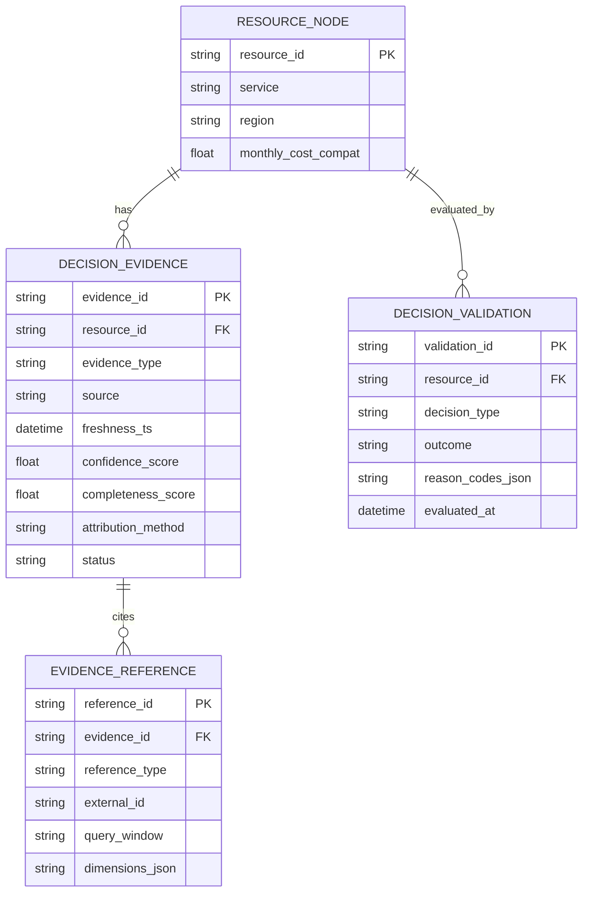

# feat: Expand aws-mock-data-service for real FinOps APIs and align backend evidence consumption

## Overview

Improve optimization decision quality by making the Rust `aws-mock-data-service` the primary delivery target for **real FinOps-related AWS APIs**, then aligning backend evidence consumption to use those APIs safely.

This plan addresses the current gaps in:
- FinOps API breadth and realism in the Rust mock service (primary focus),
- mock dataset/scenario coverage for FinOps workflows (primary focus),
- resource-level cost truth,
- typed evidence metadata (`freshness`, `confidence`, `completeness`),
- business-context + temporal behavior modeling,
- decision-level validation (not just API parity).

The target outcome is that a FinOps expert (human or agent) can exercise realistic AWS FinOps APIs locally/CI via the Rust mock service, while the backend consumes that richer evidence with explicit quality semantics.

## Problem Statement

The current architecture has a good runtime seam (`AWS_MOCK_ENDPOINT`) but the mock service API coverage is still narrow relative to FinOps workflows, and the backend still consumes evidence mostly through calibrated totals and loose metric fields.

This is effective for baseline waste detection, but leaves FinOps-grade gaps:

- Cost data can be calibrated from CE totals without resource-level billing truth linkage.
- Mock AWS API coverage is strong for currently targeted operations, but still narrow relative to FinOps needs (forecasting, commitments, rightsizing, anomalies).
- Mock scenarios/data shapes do not yet cover enough business/temporal patterns to validate FinOps decisions across realistic cases.
- Metrics and costs are stored as loosely-typed key/value fields, with no canonical evidence schema.
- Business context and temporal trend semantics are not first-class decision inputs.
- Validation is focused on API parity and contract behavior, not on whether optimization decisions remain correct under evidence drift/staleness/incompleteness.

These gaps increase the risk of recommendations that are directionally plausible but not sufficiently grounded for reliable automation or human approval at scale.

## Brainstorm Context

Relevant brainstorm found and used as planning context:
- `docs/brainstorms/2026-02-18-aws-mock-data-service-rust-cli-brainstorm.md`

Key carried-forward decisions:
- Rust `aws-mock` service remains the high-fidelity mock backbone.
- SQLite-backed, AWS-protocol-compatible mocking is the right foundation for deterministic local/CI FinOps evidence.
- Runtime endpoint switching (`AWS_MOCK_ENDPOINT`) should preserve seamless backend integration.

## Local Research Summary

### Repository patterns

- Graph enrichment already has a clear seam for cost/metrics runtime routing and fallback behavior:
  - `graph_builder.py:74`
  - `graph_builder.py:134`
  - `graph_builder.py:1003`
  - `graph_builder.py:1234`
- Current node model stores cost and metrics in loose fields, which preserves flexibility but obscures evidence semantics:
  - `models.py:184`
  - `models.py:185`
  - `models.py:186`
- Rust mock service already provides AWS-compatible transport, scenario controls, and dashboard/introspection endpoints that can be extended rather than replaced:
  - `services/aws-mock-data-service/src/cli.rs:37`
  - `services/aws-mock-data-service/src/serve.rs:25`
  - `services/aws-mock-data-service/src/serve.rs:42`
- The project already has strong contract/parity testing patterns for AWS mock expansion:
  - `tests/integration/test_cw_parity_contract.py:42`
  - `tests/integration/test_ce_parity_contract.py:19`
  - `docs/testing/aws-mock-api-coverage-status.md:59`

### Institutional learnings

Relevant learnings from `docs/solutions/`:

- High-fidelity Rust AWS mocking patterns (dual-protocol dispatch, SQLite WAL, dynamic timestamps, CLI verification) are already documented and should be reused:
  - `docs/solutions/integration-issues/high-fidelity-aws-mocking-rust-service.md:25`
  - `docs/solutions/integration-issues/high-fidelity-aws-mocking-rust-service.md:28`
  - `docs/solutions/integration-issues/high-fidelity-aws-mocking-rust-service.md:33`
  - `docs/solutions/integration-issues/high-fidelity-aws-mocking-rust-service.md:38`
- Cross-cutting invariants from scheduler/session work apply here too: encode safety in storage/API contracts, return deterministic conflicts/errors, and add regression tests for async state transitions.

Gap confirmed by learnings search:
- There is no existing documented solution for **decision evidence quality** (schema, thresholds, downgrade behavior, user-facing explanations). This should be captured as a new solution after implementation.

## Research Decision

External research is **not required** for this planning pass.

Reason:
- The repo already contains recent architecture docs, parity coverage docs, and a working Rust mock service with strong local patterns.
- The immediate planning need is to close internal integration and evidence-model gaps, not to validate a new external framework.

## SpecFlow Analysis

### Primary user flows

1. **FinOps recommendation with typed evidence (happy path)**
- Graph builder discovers resources and builds topology.
- Enrichment pipeline attaches typed cost/metric evidence (with provenance + freshness/confidence/completeness).
- FinOps expert/agent evaluates optimization candidates using topology risk + business context + temporal behavior.
- Recommendation payload includes evidence references and decision-quality status.

2. **Mock-driven CI scenario validation**
- CI generates LocalStack-backed mock dataset via Rust `aws-mock` (`gen`).
- Test suite exercises AWS-compatible endpoints and backend enrichment path.
- Assertions validate both API contracts and decision outputs under known scenarios.

3. **Evidence degradation / stale data handling**
- Enrichment pipeline detects stale/incomplete evidence (e.g., missing metric windows or unresolved cost attribution).
- Decision engine downgrades confidence, blocks auto-actions, or requests manual review.
- UI/API surfaces explicit reason codes for degraded decision quality.

4. **Scenario + coverage expansion**
- Developer adds new CE/CloudWatch/FinOps API behavior to the mock service.
- Contract/parity suites are extended.
- Decision-level tests are updated to ensure new evidence is consumed safely and correctly.

### Edge cases

- Multiple CUR line items map to a single resource with ambiguous attribution windows.
- CE totals exist but resource-level cost mapping is missing or incomplete.
- CloudWatch data is sparse/partial (short-lived resources, service-specific metric gaps).
- Business context tags are missing, inconsistent, or stale.
- Evidence freshness differs across metrics, costs, and context in a single decision bundle.
- Mock service supports an API operation but not all required filters/groupings for the target FinOps workflow.
- Temporal spikes cause false rightsizing signals without trend normalization.

### Clarifications to resolve during implementation planning (must become explicit contracts)

- Canonical resource-to-cost-evidence linking rules (resource ID, time window, aggregation strategy).
- Typed evidence metadata schema and threshold semantics.
- Which FinOps APIs/services are required for MVP vs later phases.
- Decision validation outcomes (warn vs block vs retry) and caller-facing error/reason contracts.

## Proposed Solution

Use a **mock-service-first** strategy:
1. Expand `aws-mock-data-service` to cover the real FinOps-related AWS APIs and dataset semantics the backend needs.
2. Add backend evidence-consumption improvements (typed evidence, attribution semantics, validation) as a compatibility-preserving integration track.

### 1) Expand Rust `aws-mock-data-service` as the primary FinOps API surface (primary workstream)

Prioritize mock API and dataset coverage that directly unlocks FinOps decisions:
- CE: `GetCostForecast`, `GetDimensionValues` (MVP expansion)
- CE: rightsizing + reservation/savings plan coverage/utilization (phase 2)
- CE: anomalies APIs (phase 3)
- CloudWatch: complete `GetMetricData` pagination/output parity and improve query/XML coverage
- Dataset/scenarios: business-context and temporal-behavior controls (seasonality, spikes, delayed cost visibility, sparse metrics)

Use existing parity-contract patterns and coverage scorecard tracking as the enforcement mechanism.

### 2) Add backend evidence-consumption compatibility layer (secondary workstream)

Keep `graph_builder.py` as the orchestration point for now, but split responsibilities internally into:
- **topology build** (nodes + edges + static metadata), and
- **evidence enrichment pipeline** (cost, metrics, business context, temporal summaries, evidence quality).

Compatibility requirement:
- Continue populating `ResourceNode.monthly_cost` and `ResourceNode.usage_metrics[...]` for existing consumers while backend migration is in progress.
- Add structured evidence alongside these fields during the transition.

### 3) Add a typed decision-evidence schema (backend models; enable richer mock-service outputs)

Define a canonical schema for evidence attached to resources and decisions, including:
- evidence type (`cost`, `metric`, `context`, `forecast`, `commitment_coverage`, etc.),
- source/provenance (mock/aws/localstack/heuristic),
- freshness timestamp and freshness window,
- completeness score and missing facets,
- confidence score and downgrade reasons,
- trace references (mock response IDs, line item IDs, query window, dimensions).

This allows the FinOps expert to reason over evidence quality explicitly rather than inferring quality from ad hoc `usage_metrics` keys.

### 4) Upgrade cost evidence from calibrated totals to attributable resource evidence

Add resource-level cost evidence paths in stages:
- retain current CE total calibration as fallback,
- add resource/group-level CE evidence where possible,
- add line-item/near-line-item evidence modeling in the mock service (CUR-like data and references),
- record explicit attribution method on every cost evidence record.

Decision policy must treat calibrated-only evidence as lower confidence than directly attributable evidence.

### 5) Add business context and temporal behavior as first-class evidence (mock datasets + backend summaries)

Enrichment pipeline should produce structured summaries such as:
- owner / cost center / environment / criticality / maintenance window,
- trend summaries (7d/14d/30d deltas, variance, anomaly flags),
- stability indicators (sample count, sparsity, partial window coverage).

This supports safer FinOps decisions (e.g., avoid rightsizing a workload with recent spikes or missing business ownership).

### 6) Add decision-level validation suites (API parity + backend decision correctness)

Extend testing beyond API parity:
- scenario-driven tests that assert decision outcomes and confidence gates,
- evidence degradation tests (stale data, incomplete mappings, partial metrics),
- regression tests for fallback precedence and downgrade behavior,
- dashboard/API checks that evidence quality is surfaced to operators.

## Technical Approach

### Architecture

Introduce a staged architecture that preserves current runtime behavior while enabling stronger evidence semantics:

1. Rust `aws-mock-data-service` is the primary source for deterministic FinOps API behavior in LocalStack/CI.
2. Contract parity tests and coverage scorecards gate mock-service expansion before backend adoption.
3. `ResourceGraphBuilder` remains the backend entrypoint for topology and enrichment orchestration.
4. New enrichment components produce structured `DecisionEvidence` records and derived summaries during migration.
5. FinOps expert/decision logic consumes both legacy fields and structured evidence until cutover is complete.

### Proposed data model additions (conceptual)

- `DecisionEvidence` (per resource, per evidence type)
- `DecisionEvidenceBundle` (aggregated evidence set + quality summary)
- `DecisionValidationResult` (pass/warn/block + reasons)

### ERD (conceptual evidence persistence / caching model)

### Implementation Phases

#### Phase 1: Rust mock service FinOps API MVP expansion (primary)

Deliverables:
- CloudWatch + Cost Explorer parity improvements required for near-term FinOps workflows.
- MVP FinOps CE APIs (`GetCostForecast`, `GetDimensionValues`) in Rust mock service.
- Updated parity contracts, fixtures, and coverage status docs.

Tasks:
- [ ] Complete CloudWatch `GetMetricData` pagination/output parity (`NextToken`) and close current `xfail`/coverage gaps.
- [ ] Add/complete CloudWatch Query/XML contract coverage for `GetMetricData`.
- [ ] Implement CE `GetCostForecast` in `services/aws-mock-data-service/src/serve.rs` + handlers/tests.
- [ ] Implement CE `GetDimensionValues` in `services/aws-mock-data-service/src/serve.rs` + handlers/tests.
- [ ] Extend parity fixtures and scorecard assertions (`tests/integration/test_*_parity_contract.py`, fixtures, helpers).
- [ ] Update `docs/testing/aws-mock-api-coverage-status.md` and CLI parity command matrix docs.

#### Phase 2: Rust mock service FinOps API breadth + dataset realism (primary)

Deliverables:
- Additional FinOps CE APIs for rightsizing, commitments, and anomalies.
- Expanded mock scenarios covering business-context and temporal behavior patterns.
- Mock-side data semantics sufficient for backend attribution and validation testing.

Tasks:
- [ ] Add CE `GetRightsizingRecommendation` with scoped mock semantics and parity tests.
- [ ] Add CE reservation + savings plans coverage/utilization APIs with scoped mock semantics and parity tests.
- [ ] Add CE anomalies APIs (`GetAnomalies`, monitors/subscriptions) with deterministic scenario outputs.
- [ ] Extend generator/scenario model for temporal patterns (seasonality/spike/late-cost visibility) and business-context fields.
- [ ] Add parity/live-shadow and robustness tests for new API surfaces and scenario switching behavior.

#### Phase 3: Backend evidence consumption + attribution semantics (secondary integration)

Deliverables:
- Typed evidence models and compatibility adapters.
- Resource-level cost evidence references and attribution semantics in backend enrichment.
- Fallback hierarchy with explicit degrade reasons.

Tasks:
- [ ] Add typed evidence models (e.g., `DecisionEvidence`, bundles, validation outcomes) in backend model layer (`models.py` or new `decision_evidence_models.py`).
- [ ] Refactor `graph_builder.py` to separate topology build from enrichment steps without changing external graph builder API.
- [ ] Preserve compatibility outputs (`monthly_cost`, `usage_metrics`) while adding structured evidence on nodes or sidecar bundle.
- [ ] Normalize provenance fields for cost and metrics (source + freshness + fallback/degrade reasons) replacing magic-number-only semantics (`cost_source`, `cpu_source`) with named constants/enum mapping.
- [ ] Extend enrichment logic to attach structured cost evidence references, including window and attribution method.
- [ ] Add regression tests for mixed evidence quality (partial attribution, missing mappings, stale cost windows).

#### Phase 4: Decision validation + operator visibility (integration confidence)

Deliverables:
- Decision-validation suites and confidence gating tests.
- Operator-facing visibility for evidence quality and mock coverage context.

Tasks:
- [ ] Define required business-context fields (owner, environment, cost center, criticality, policy tags) and source precedence (tags/config/defaults).
- [ ] Add temporal summary generation (lookback coverage, variance, trend deltas, anomaly hints) for key resource types consuming mock-service outputs.
- [ ] Add decision rules that degrade/block automation when context/evidence quality thresholds are not met.
- [ ] Add decision-level integration tests that assert recommendations + confidence gates across baseline/spike/idle-heavy scenarios.
- [ ] Add tests for stale/incomplete evidence handling (warn vs block vs manual-review routing).
- [ ] Extend dashboard/API payloads (mock dashboard and/or backend endpoints) to surface evidence quality summaries and parity coverage context.
- [ ] Document evidence quality semantics, thresholds, and troubleshooting runbook.
- [ ] Capture a new `docs/solutions/` learning entry for decision evidence quality and downgrade patterns.

## Alternative Approaches Considered

### A) Keep graph builder as-is and only expand mock API coverage

Pros:
- Fastest path to more AWS-like mock behavior.
- Reuses existing parity/test infrastructure.

Cons:
- Does not solve typed evidence semantics, confidence gating, or decision-level validation gaps.
- Risks continued logic spread in `usage_metrics` string keys.

Decision: reject as sole solution; use as one track within a broader evidence-model plan.

### B) Replace `graph_builder` with a new dedicated topology service before evidence work

Pros:
- Strong separation of concerns from day one.

Cons:
- High migration cost and broad regression risk.
- Delays immediate improvement to decision quality.

Decision: defer. Start with internal boundary separation in existing `graph_builder.py`.

### C) Full CUR/Athena parity in mock service before any backend evidence changes

Pros:
- Potentially strongest cost-truth realism.

Cons:
- Large scope; backend still lacks typed evidence/quality model to consume it safely.

Decision: defer full parity. Implement resource-level attribution semantics and mock CUR-like references incrementally.

## Acceptance Criteria

### Functional Requirements

- [ ] Optimization decisions can reference structured evidence records (cost, metrics, context) rather than only loose `usage_metrics` keys.
- [ ] Every decision evidence record includes source/provenance and freshness metadata.
- [ ] Cost evidence exposes attribution method and degrade reason when resource-level truth is unavailable.
- [ ] Business context fields required for policy gating are surfaced in decision bundles (or explicit missing-field reasons are returned).
- [ ] Temporal summaries are available for supported resource types and used by decision confidence rules.
- [ ] Rust `aws-mock-data-service` supports the MVP FinOps API expansion set (`GetCostForecast`, `GetDimensionValues`) and improved CloudWatch parity required by the backend.
- [ ] Rust `aws-mock-data-service` supports at least one commitment-optimization API path (reservation or savings plans coverage/utilization) and one rightsizing/anomaly path in deterministic scenarios.

### Non-Functional Requirements

- [ ] Legacy consumers of `ArchitectureGraph` continue to work during migration (`monthly_cost`, `usage_metrics` compatibility preserved).
- [ ] Evidence enrichment degrades deterministically under partial mock/API failures (no silent drop to heuristic without reason codes).
- [ ] Mock service dataset generation and serving remain fast enough for CI iteration (no material regression to current parity suite runtime without justification).
- [ ] Evidence quality calculations are deterministic under fixed mock time controls in tests.

### Quality Gates

- [ ] API parity contract suites pass for all newly added mock AWS operations.
- [ ] Mock service coverage status docs and scorecards are updated to reflect new FinOps APIs and gaps.
- [ ] Unit tests cover evidence models, downgrade thresholds, and compatibility adapters.
- [ ] Decision-level scenario tests pass for baseline/spike/idle-heavy and at least one incomplete/stale evidence scenario.
- [ ] Coverage docs and runbooks are updated (`aws-mock` coverage status + evidence quality docs).
- [ ] A new `docs/solutions/` entry documents decision evidence quality patterns and pitfalls.

## Success Metrics

- Increase in FinOps-relevant AWS mock API operations supported and parity-tested.
- Reduction in optimization recommendations that rely on heuristic-only cost/metric evidence.
- Percentage of recommendations with attributable resource-level cost evidence (vs calibrated-total-only).
- Percentage of decisions carrying complete business-context evidence.
- Decision validation pass rate across deterministic scenario suites.
- Time-to-diagnose recommendation disputes reduced via surfaced evidence references and degrade reasons.

## Dependencies & Prerequisites

- Rust mock service remains buildable and operable in local/CI environments:
  - `services/aws-mock-data-service/Makefile`
  - `Makefile` root `*-mock` targets
- LocalStack dataset seeding and mock generation workflows remain available.
- Agreement on evidence quality thresholds and policy gating semantics from product/FinOps stakeholders.
- Test harness support for fixed/mock time and scenario selection across backend + mock service.

## Risk Analysis & Mitigation

- Risk: expanded mock API coverage increases complexity faster than decision value.
  - Mitigation: prioritize APIs strictly by decision impact (forecast/dimensions first), track parity scope in coverage doc.

- Risk: backend integration lags behind mock-service capabilities, leaving new APIs unused.
  - Mitigation: keep a thin backend integration track each phase (compatibility consumers + decision tests) rather than deferring all backend work to the end.

- Risk: evidence-schema rollout breaks existing graph consumers.
  - Mitigation: compatibility layer with phased migration and explicit backward-compat tests.

- Risk: false confidence from mock data fidelity mismatches.
  - Mitigation: surface evidence source + completeness + parity coverage context in decision outputs and dashboard diagnostics.

- Risk: ambiguous resource-to-cost attribution creates incorrect savings claims.
  - Mitigation: explicit attribution method and ambiguity downgrade/block behavior; add regression scenarios for many-to-one mappings.

- Risk: performance regressions in CI due to heavier evidence and scenario generation.
  - Mitigation: reuse SQLite/WAL patterns, transactional writes, and targeted parity suites before expanding nightly coverage.

## Resource Requirements

- Engineering:
  - 1 backend engineer (graph/enrichment/evidence model)
  - 1 Rust engineer (mock API + dataset expansion)
  - 1 test/integration owner (parity + decision validation)
- Product/FinOps input:
  - Thresholds for confidence/completeness and required business-context fields.
- Tooling:
  - CI jobs for parity contracts + decision scenarios
  - Mock coverage scorecard maintenance

## Future Considerations

- Full CUR/Athena ingestion parity or integration for production-like cost truth.
- Separate `topology_builder` and `evidence_enricher` modules/services once interface stabilizes.
- Policy-driven FinOps decision profiles (conservative/aggressive/compliance) keyed off evidence quality thresholds.
- Explainable recommendation UI that links directly to evidence references and mock parity coverage state.

## Documentation Plan

- Cross-link with API decision-surface planning/tracking docs:
  - `docs/plans/2026-02-22-feat-real-aws-finops-devops-api-decision-map-roadmap-plan.md`
  - `docs/testing/aws-finops-devops-api-decision-map.md`
  - `docs/testing/aws-api-priority-roadmap.md`
- Update existing docs:
  - `docs/testing/aws-mock-api-coverage-status.md` (new APIs, parity status, coverage counts)
  - `README.md` (runtime mock + evidence quality notes, if user-facing)
  - backend architecture docs referencing graph/enrichment boundary changes
- Add new docs:
  - `docs/testing/decision-evidence-quality-matrix.md` (thresholds, degrade reasons, examples)
  - `docs/testing/finops-decision-scenario-matrix.md` (baseline/spike/stale/incomplete cases)
  - `docs/solutions/<date>-decision-evidence-quality-...md` (post-implementation learning)

## References & Research

### Internal References

- Graph builder enrichment/runtime mock routing:
  - `graph_builder.py:74`
  - `graph_builder.py:134`
  - `graph_builder.py:1003`
  - `graph_builder.py:1015`
  - `graph_builder.py:1023`
  - `graph_builder.py:1096`
  - `graph_builder.py:1234`
  - `graph_builder.py:1250`
  - `graph_builder.py:1261`
  - `graph_builder.py:1306`
- Graph model cost/metrics fields:
  - `models.py:184`
  - `models.py:185`
  - `models.py:186`
- Rust mock service CLI and server surface:
  - `services/aws-mock-data-service/src/cli.rs:37`
  - `services/aws-mock-data-service/src/serve.rs:25`
  - `services/aws-mock-data-service/src/serve.rs:87`
- Mock coverage status and priorities:
  - `docs/testing/aws-mock-api-coverage-status.md:10`
  - `docs/testing/aws-mock-api-coverage-status.md:59`
  - `docs/testing/aws-mock-api-coverage-status.md:90`
  - `docs/testing/aws-mock-api-coverage-status.md:95`
  - `docs/testing/aws-mock-api-coverage-status.md:112`
- Contract/parity tests:
  - `tests/integration/test_cw_parity_contract.py:42`
  - `tests/integration/test_ce_parity_contract.py:19`
- Prior brainstorm and mock-service solution:
  - `docs/brainstorms/2026-02-18-aws-mock-data-service-rust-cli-brainstorm.md`
  - `docs/solutions/integration-issues/high-fidelity-aws-mocking-rust-service.md:25`
  - `docs/solutions/integration-issues/high-fidelity-aws-mocking-rust-service.md:28`
  - `docs/solutions/integration-issues/high-fidelity-aws-mocking-rust-service.md:33`
  - `docs/solutions/integration-issues/high-fidelity-aws-mocking-rust-service.md:38`

### Research Findings Incorporated

- Use Rust mock service as the decision-evidence data source foundation rather than introducing another mock service.
- Reuse parity-contract and scorecard patterns for all mock API expansions.
- Encode evidence quality and downgrade semantics explicitly (storage/API/tests), mirroring existing invariant-first patterns used elsewhere in the repo.
