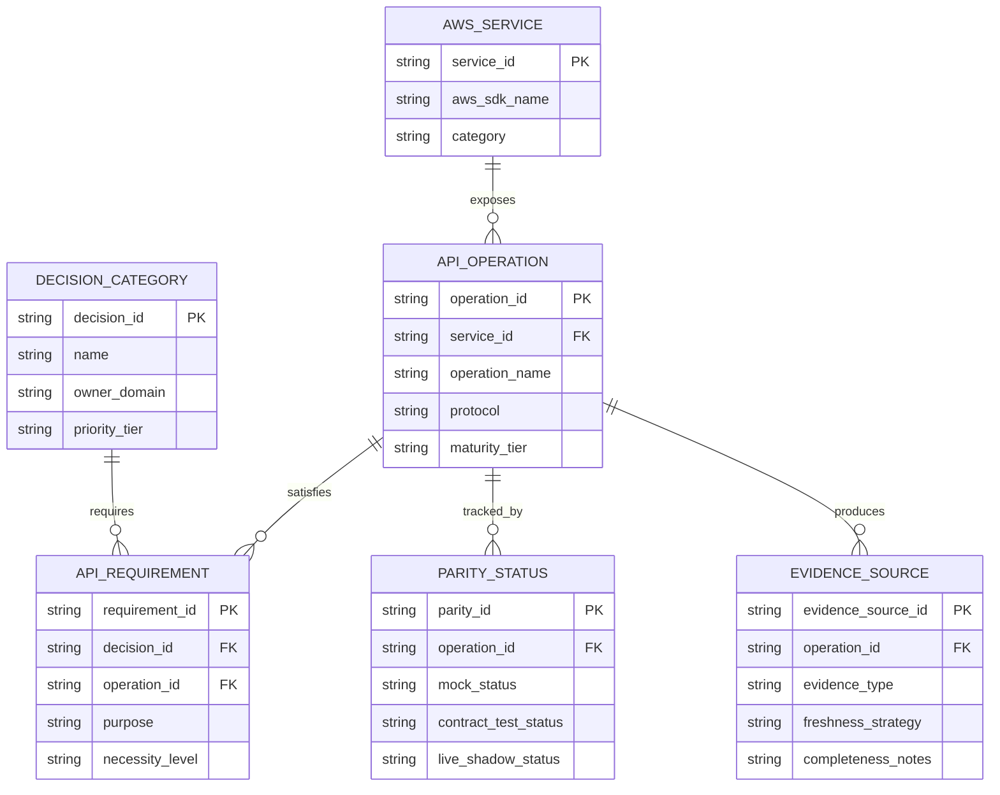
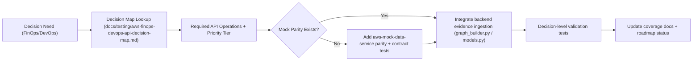

# feat: Real AWS FinOps/DevOps API decision map and phased integration roadmap

## Overview

Create a detailed, implementation-ready roadmap for the `aws-optimize-agent` to support the **real AWS APIs** that FinOps experts and DevOps engineers use to gather evidence and make decisions, while explicitly **deferring IAM design/policy work**.

This plan converts the AWS API research into a phased execution strategy across:
- API inventory and decision mapping
- prioritization (MVP vs later phases)
- mock-service parity expansion (`aws-mock-data-service`)
- backend evidence ingestion seams (`graph_builder.py` and related flows)
- testing, rollout, and documentation

The outcome is a clear path from today’s focused CloudWatch + Cost Explorer support to a broader, decision-grade AWS API surface that remains testable locally and in CI.

## Enhancement Summary

**Planning depth:** A LOT (comprehensive roadmap)  
**Primary audience:** agent/backend maintainers, mock-service maintainers, FinOps feature owners  
**Planning assumption:** IAM permissions/roles/policies are intentionally out of scope for this pass and will be planned separately.

## Brainstorm Context

Found relevant brainstorm from 2026-02-18 and used as context:
- `docs/brainstorms/2026-02-18-aws-mock-data-service-rust-cli-brainstorm.md`

Key carry-forwards:
- Rust `aws-mock-data-service` remains the protocol-fidelity backbone for LocalStack gaps.
- AWS wire compatibility is a core architectural seam, not a test-only convenience.
- Local/CI determinism is a first-class requirement for API and decision validation.

## Problem Statement

The project already has strong foundations for mock-driven AWS behavior, but the current supported API breadth is still narrow relative to how real FinOps/DevOps teams operate.

Current reality:
- `graph_builder.py` has a runtime seam for mock/LocalStack cost + metric evidence, but real AWS enrichment is still incomplete (for example the explicit TODO for real Cost Explorer integration).
- Mock parity coverage is strong for targeted operations (`GetMetricData`, `GetMetricStatistics`, `GetCostAndUsage`) but not yet broad enough for commitment optimization, recommendations, anomalies, tagging/governance, or multi-account evidence collection.
- The system lacks a canonical **API-to-decision map** that explains which AWS APIs support which decisions and how they should be prioritized.

Without that decision map and phased roadmap, API expansion risks becoming:
- ad hoc (implementing operations without decision payoff),
- duplicative (overlapping with existing plans),
- hard to validate (parity breadth grows faster than evidence-consumption correctness).

## Scope

### In Scope

- Build a canonical FinOps/DevOps AWS API inventory and decision map (real AWS APIs only).
- Define phased implementation priorities (MVP / Phase 1 / Phase 2 / Phase 3).
- Map each API to:
  - decision use cases,
  - evidence type,
  - backend touchpoints,
  - mock parity needs,
  - test strategy.
- Define integration strategy for:
  - `graph_builder.py` enrichment paths,
  - future evidence adapters,
  - mock-service contract/parity expansion.
- Define rollout and validation plan (local, CI, optional live shadow).
- Document explicit non-goals and deferred items (especially IAM).

### Out of Scope (Deferred)

- IAM permissions, roles, policies, SCPs, delegated admin setup, trust policies.
- Production AWS account onboarding and organizational governance rollout.
- Implementing all listed APIs in this plan (this is planning only).
- UI redesign work (only API/data implications are in scope).

## Research Consolidation

## Internal Repo Findings

### Existing runtime integration seams (backend)

- `graph_builder.py` already supports runtime endpoint switching via `AWS_MOCK_ENDPOINT`, which is the correct seam for incremental adoption:
  - `graph_builder.py:74`
  - `graph_builder.py:143`
  - `graph_builder.py:146`
- Cost calibration currently prefers mock Cost Explorer when configured, but explicitly logs that real AWS CE enrichment is not yet implemented:
  - `graph_builder.py:1011`
  - `graph_builder.py:1015`
  - `graph_builder.py:1096`
  - `graph_builder.py:1097`
- CloudWatch metric enrichment already has a similar runtime seam and mock endpoint behavior:
  - `graph_builder.py:1158`
  - `graph_builder.py:1159`
  - `graph_builder.py:1160`

### Current evidence storage shape (backend models)

- `ResourceNode` currently stores `monthly_cost` and a loose `usage_metrics` dictionary, which is good for compatibility but weak for typed decision evidence:
  - `models.py:164`
  - `models.py:185`
  - `models.py:186`

### Existing mock-service capabilities and protocol routing (Rust)

- The Rust mock service already exposes dashboard/introspection endpoints and protocol-aware routes:
  - `services/aws-mock-data-service/src/serve.rs:29`
  - `services/aws-mock-data-service/src/serve.rs:31`
  - `services/aws-mock-data-service/src/serve.rs:35`
  - `services/aws-mock-data-service/src/serve.rs:39`
- Cost Explorer and CloudWatch targeted operations are already routed with explicit target/action handling:
  - `services/aws-mock-data-service/src/serve.rs:953`
  - `services/aws-mock-data-service/src/serve.rs:969`
  - `services/aws-mock-data-service/src/serve.rs:979`
  - `services/aws-mock-data-service/src/serve.rs:1151`
  - `services/aws-mock-data-service/src/serve.rs:1301`
  - `services/aws-mock-data-service/src/serve.rs:1432`
- Unsupported-action behavior is already a first-class contract path and should remain so for incremental coverage:
  - `services/aws-mock-data-service/src/serve.rs:1175`
  - `services/aws-mock-data-service/src/serve.rs:1312`
  - `services/aws-mock-data-service/src/serve.rs:1462`

### Existing parity/testing governance (strong base to extend)

- Coverage status and prioritized next FinOps APIs are already documented and should be reused, not replaced:
  - `docs/testing/aws-mock-api-coverage-status.md:95`
  - `docs/testing/aws-mock-api-coverage-status.md:112`
  - `docs/testing/aws-mock-api-coverage-status.md:139`
- Manual CLI parity command matrix exists for current CloudWatch/Cost Explorer support and gives a model for future operator validation docs:
  - `docs/testing/aws-cli-parity-command-matrix.md:5`
  - `docs/testing/aws-cli-parity-command-matrix.md:48`
  - `docs/testing/aws-cli-parity-command-matrix.md:150`
- Current parity contract suites are already present and should be expanded by service/API family:
  - `tests/integration/test_cw_parity_contract.py`
  - `tests/integration/test_ce_parity_contract.py`
  - `tests/integration/test_error_contracts.py`
  - `tests/integration/test_pagination_contracts.py`
  - `tests/integration/test_parity_live_shadow.py`

### Related existing plan (avoid duplication)

There is already a same-day, adjacent plan focused on mock coverage + evidence enrichment:
- `docs/plans/2026-02-22-feat-finops-decision-evidence-enrichment-and-mock-coverage-plan.md`

This new plan should complement it by providing:
- the **canonical AWS API decision surface** (FinOps + DevOps),
- a **priority roadmap across services/APIs**,
- explicit scoping boundaries (what to mock first vs what to integrate later),
- a reusable **API registry/decision map artifact**.

## Institutional Learnings (from `docs/solutions/`)

Relevant direct learning:
- `docs/solutions/integration-issues/high-fidelity-aws-mocking-rust-service.md`

Key reusable patterns:
- Treat LocalStack gaps as architectural seams, not ad hoc test patches.
- Preserve dual-protocol support (CloudWatch Query/XML + JSON targets, Cost Explorer JSON targets).
- Use SQLite WAL + batching for efficient seed/update workflows.
- Use relative-time fixtures for rolling-window stability in tests.

Relevant adjacent integration/data correctness learnings:
- `docs/solutions/integration-issues/scheduled-session-unification-invariants-assistant-20260216.md`
- `docs/solutions/logic-errors/incremental-scan-ledger-state-regressions-assistant-20260213.md`
- `docs/solutions/database-issues/anchor-schedule-dedupe-survivor-selection-assistant-20260217.md`

Transferable lessons for this roadmap:
- Define canonical evidence identity keys (not resource ID alone).
- Enforce idempotency and dedupe invariants in storage/contracts first.
- Treat “no findings / no evidence delta” as a valid successful run outcome.
- Avoid recency assumptions based on insertion order for backfills/merges.

## External Research Decision

External research was required and completed for this planning input because:
- the topic directly targets AWS APIs (high-change external surface),
- “real AWS APIs used by FinOps/DevOps” requires authoritative current docs,
- API scope and operation names must be exact.

This plan uses the AWS API inventory previously researched in this thread (Cost Explorer, Cost Optimization Hub, Compute Optimizer, Budgets, Pricing, Savings Plans, Trusted Advisor, CloudWatch, Logs, Config, Organizations, STS, tagging, Service Quotas, Health, CloudTrail, Athena/S3/Glue, plus service-native `Describe*`/`List*` APIs).

## Proposed Solution

Build and maintain a **decision-oriented AWS API roadmap** instead of an undifferentiated API backlog.

The roadmap is centered on four artifacts:

1. **AWS API Registry (canonical inventory)**
- A machine-readable list of real AWS APIs and selected operations used by FinOps/DevOps.
- Includes service, operations, decision categories, priority tier, and parity status.

2. **Decision Map (human-readable)**
- A document that maps operational decisions (rightsizing, commitment optimization, anomaly triage, ownership remediation, quota planning, change correlation, etc.) to the AWS APIs required for evidence.

3. **Implementation Priority Matrix**
- A phased backlog describing what to implement in mock parity first, what to integrate in backend evidence ingestion next, and what to defer.

4. **Validation Matrix**
- For each API family: contract parity tests, decision-level tests, and optional live AWS shadow tests.

### API Priority Model (High-level)

### Tier 0: Current foundation / immediate extension

Primary goal: strengthen current FinOps evidence path without changing architecture shape.

- Cost Explorer (`ce`)
  - `GetCostAndUsage` (existing)
  - `GetCostForecast`
  - `GetDimensionValues`
  - `GetRightsizingRecommendation`
  - `GetReservationCoverage`
  - `GetReservationUtilization`
  - `GetSavingsPlansCoverage`
  - `GetSavingsPlansUtilization`
  - anomalies APIs (`GetAnomalies`, monitors/subscriptions as needed)
- CloudWatch (`cloudwatch`)
  - `GetMetricData` parity completion
  - `GetMetricStatistics`
  - `ListMetrics`
- CloudWatch Logs (`logs`)
  - `StartQuery`
  - `GetQueryResults`
- Tagging / ownership
  - `resourcegroupstaggingapi:GetResources`, `GetTagKeys`, `GetTagValues`

### Tier 1: Recommendations and commitment optimization breadth

- `compute-optimizer` recommendation operations (EC2/EBS/ASG/ECS/Lambda/RDS, idle recommendations)
- `cost-optimization-hub` recommendation listing and summaries
- `savingsplans` portfolio + offerings/rates APIs
- `budgets` budget and history surfaces
- `pricing` price catalog lookup operations
- `trustedadvisor` recommendation/check listing (where supported)

### Tier 2: Governance and multi-account ops evidence

- `organizations` account/OU inventory
- `sts` session identity / assume-role boundary (behavior only; IAM deferred)
- `config` aggregate queries / resource config selection
- `servicequotas` quota inventory
- `health` events and affected entities
- `cloudtrail` `LookupEvents`

### Tier 3: Analytics and workload-specific validation surfaces

- `athena`, `s3`, `glue` (CUR/Data Exports query workflows)
- Service-native `Describe*`/`List*` APIs (`ec2`, `rds`, `ecs`, `eks`, `lambda`, `elbv2`, etc.) used to confirm recommendation safety and resource state before action

## Technical Approach

### Architecture Strategy (Planning Target)

Use a staged architecture that preserves compatibility and maximizes testability:

1. **Define the API registry + decision map first** (authoritative scope control).
2. **Expand mock parity only for APIs that unlock a prioritized decision** (avoid breadth-only work).
3. **Integrate evidence ingestion in backend using existing seams** (`graph_builder.py` initially).
4. **Add typed evidence metadata incrementally** while preserving `monthly_cost` / `usage_metrics` compatibility.
5. **Validate both API contracts and decision outcomes** before widening the supported API matrix.

### Proposed Artifacts and File Targets

This plan does not implement them, but defines likely targets:

- `docs/testing/aws-finops-devops-api-decision-map.md`
  - Human-readable matrix (decision -> APIs -> operations -> status)
- `docs/testing/aws-api-priority-roadmap.md`
  - Phased implementation backlog and status tracking
- `docs/testing/aws-mock-api-coverage-status.md`
  - Continue updating current mock coverage document (existing)
- `graph_builder.py`
  - Incremental evidence ingestion integration points (existing seam)
- `models.py`
  - Compatibility-preserving typed evidence model additions (future)
- `services/aws-mock-data-service/src/serve.rs`
  - Route/dispatch expansion for prioritized operations
- `services/aws-mock-data-service/src/handlers/*.rs`
  - Per-service operation handlers as coverage grows
- `tests/integration/test_*_parity_contract.py`
  - Service/API family parity suites
- `tests/integration/fixtures/aws_parity/*`
  - Request/response contract case matrices

### ERD (Conceptual registry + evidence planning model)

## SpecFlow Analysis

### User Flow Overview

1. **Planner/maintainer defines a decision target**
- Example: rightsizing EC2 instances, commitment coverage review, spend anomaly triage, quota risk review.

2. **Decision map identifies required evidence APIs**
- The system (or developer) looks up the canonical decision map to see which AWS APIs and operations are required vs optional.

3. **Mock parity status is checked**
- If a required API/operation is not available in `aws-mock-data-service`, parity work is scheduled before backend dependence is added.

4. **Backend integration uses existing evidence seams**
- `graph_builder.py` consumes mock or real AWS evidence via current runtime endpoint patterns.

5. **Decision-level tests validate outcomes**
- Tests assert not only wire contract parity, but that the resulting recommendation/evidence classification is correct.

6. **Roadmap and docs are updated**
- Coverage status, decision map, and parity matrix remain synchronized.

### Flow Diagram

### Flow Permutations Matrix

| Dimension | Variants |
|---|---|
| Domain | FinOps, DevOps |
| Evidence source | Mock service, LocalStack fallback, real AWS |
| Account scope | Single account, org multi-account |
| Data freshness | Fresh, stale, partial, delayed |
| Decision type | rightsizing, commitments, anomalies, ownership, quota, incident correlation |
| Validation mode | contract-only, decision-level, optional live shadow |

### Key Edge Cases to Plan For

- API operation exists in mock service but lacks one filter/grouping variant required by the decision.
- CE totals exist but resource attribution is incomplete or ambiguous.
- CloudWatch metrics are sparse (short-lived resources) while cost data is present.
- Tagging/ownership data is missing or inconsistent across accounts.
- Multi-account inventory scope (Organizations/STS) changes the interpretation of “global totals”.
- Quota, health, and CloudTrail evidence are region/account scoped differently than CE/Budgets.
- Pricing catalogs drift or have attribute mismatches that break price normalization.
- Trusted Advisor / Health eligibility differs by support plan (must be represented as capability state).

### Critical Clarifications (Assumptions for Implementation)

1. **MVP goal**
- Assumption: MVP focuses on decision-value APIs first (CE + CloudWatch + tagging + minimal logs), not maximum service breadth.

2. **Registry format**
- Assumption: Start with a versioned markdown + optional JSON/YAML export generated from the same source of truth.

3. **Backend refactor scope**
- Assumption: `graph_builder.py` remains the integration entry point initially; deeper extraction into adapters is a later phase unless coupling blocks progress.

4. **Live AWS validation**
- Assumption: Optional/manual or nightly, not required for every CI run.

5. **IAM**
- Assumption: Defer completely (permission checks, role strategy, delegated admin) and represent only capability prerequisites in docs.

## Implementation Phases

### Phase 0: Inventory, Registry, and Decision Map (Foundation)

**Goal:** Establish a canonical, shared scope before expanding code.

**Deliverables**
- `docs/testing/aws-finops-devops-api-decision-map.md` (human-readable matrix)
- `docs/testing/aws-api-priority-roadmap.md` (phased backlog)
- Updated `docs/testing/aws-mock-api-coverage-status.md` section linking to the decision map
- Cross-reference note in `docs/plans/2026-02-22-feat-finops-decision-evidence-enrichment-and-mock-coverage-plan.md`

**Tasks**
- [x] Define decision categories and names (rightsizing, commitments, anomalies, ownership, quota planning, incident correlation).
- [x] Build service/API inventory table from current research (service client name + key operations + decision usage).
- [x] Assign priority tiers and implementation sequence.
- [x] Annotate each operation with parity status fields (implemented/tested/unimplemented/deferred).
- [x] Mark IAM as deferred and capture only capability prerequisites (for example “support-plan-dependent”).

**Success Criteria**
- A maintainer can answer “which API supports this decision?” without searching multiple docs.
- The roadmap cleanly distinguishes “mock parity needed” vs “backend integration needed”.

### Phase 1: Extend Core FinOps Evidence APIs (Mock Parity First)

**Goal:** Expand the highest-value FinOps API surface that directly improves recommendation realism.

**Primary APIs**
- Cost Explorer: `GetCostForecast`, `GetDimensionValues`, `GetRightsizingRecommendation`, commitment coverage/utilization APIs, savings plans coverage/utilization APIs, anomalies APIs
- CloudWatch: `GetMetricData` parity completion (`NextToken` semantics), `ListMetrics`
- CloudWatch Logs: `StartQuery`, `GetQueryResults` (minimal, deterministic subset)
- Resource Groups Tagging API: `GetResources`, `GetTagKeys`, `GetTagValues`

**Likely code touchpoints**
- `services/aws-mock-data-service/src/serve.rs`
- `services/aws-mock-data-service/src/handlers/*`
- `services/aws-mock-data-service/src/generator.rs`
- `services/aws-mock-data-service/src/metrics.rs`
- `docs/testing/aws-mock-api-coverage-status.md`
- `tests/integration/test_ce_parity_contract.py`
- `tests/integration/test_cw_parity_contract.py`
- new parity suites (for logs/tagging as introduced)

**Tasks**
- [x] Close existing `GetMetricData` pagination parity gap and remove related `xfail`/coverage debt.
- [x] Add CE `GetCostForecast` + `GetDimensionValues` contract cases and handlers.
- [x] Add CE commitment coverage/utilization APIs for RI/SP decision scenarios.
- [x] Add CE rightsizing/anomaly endpoints for decision simulation flows.
- [ ] Add deterministic mock datasets/scenarios for tag coverage gaps, metric sparsity, and anomaly windows.
- [ ] Introduce minimal CloudWatch Logs Insights query contract for evidence drill-down workflows.
- [ ] Add tagging API contracts to support ownership/cost-allocation decision evidence.

**Success Criteria**
- Tier 0 APIs in the decision map are either implemented/tested or explicitly deferred with reason.
- Mock coverage docs and parity suites reflect the same operation inventory.

### Phase 2: Backend Evidence Ingestion and Decision Mapping Integration

**Goal:** Use the new API surfaces to improve backend evidence quality without breaking current consumers.

**Likely code touchpoints**
- `graph_builder.py`
- `models.py`
- `orchestrator_tools_analysis.py`
- `orchestrator_tools_explore.py`
- `orchestrator_tools_plan.py`
- tests under `tests/unit/` and `tests/e2e/`

**Tasks**
- [ ] Define compatibility-safe evidence mapping rules (API response -> `monthly_cost` / `usage_metrics` and future typed evidence fields).
- [ ] Add a canonical decision-evidence mapping layer (even if initially in `graph_builder.py`).
- [ ] Record evidence provenance/freshness/completeness metadata where possible.
- [ ] Add explicit fallback ordering (mock API -> local fixtures -> heuristics) with reason logging.
- [ ] Add decision map references to plan-generation / investigation outputs (operator-visible evidence provenance).
- [ ] Preserve behavior for existing detectors/executors until decision evidence cutover is validated.

**Success Criteria**
- Existing workflows continue to function with compatibility fields.
- New evidence sources improve decision context and are traceable in logs/artifacts.

### Phase 3: Recommendation/Governance Breadth Expansion

**Goal:** Expand beyond core CE/CW flows into real FinOps/DevOps decision breadth.

**Primary APIs**
- `compute-optimizer`
- `cost-optimization-hub`
- `savingsplans`
- `pricing`
- `budgets`
- `trustedadvisor`
- `organizations`, `sts`, `config`, `servicequotas`, `health`, `cloudtrail`

**Tasks**
- [ ] Add registry entries + decision mappings for recommendation/governance APIs.
- [ ] Prioritize parity and/or integration by concrete decision payoff (not by service popularity).
- [ ] Model capability states (for example support-plan-gated APIs) in the decision map.
- [ ] Add multi-account scope semantics (org, member, region) to the registry.
- [ ] Add decision-level tests for cross-account and governance-based evidence flows.

**Success Criteria**
- The roadmap supports both FinOps and DevOps evidence-driven decisions, not only cost/metering decisions.

### Phase 4: Analytics and Service-Native Validation Surfaces

**Goal:** Support deeper evidence triangulation and action-safety validation.

**Primary APIs**
- `athena`, `s3`, `glue` for billing analytics pipelines (CUR/Data Exports)
- Service-native `Describe*`/`List*` APIs (`ec2`, `rds`, `ecs`, `eks`, `lambda`, `elbv2`, etc.)

**Tasks**
- [ ] Define which decisions require analytics-backed evidence vs can rely on CE summaries.
- [ ] Add registry entries for workload validation APIs tied to pre-action safety checks.
- [ ] Add test fixtures/scenarios for “recommendation looks valid but service state says unsafe”.
- [ ] Document when service-native state is authoritative over higher-level recommendations.

**Success Criteria**
- The decision map captures evidence precedence and conflict-handling guidance.

## Alternative Approaches Considered

### 1. Implement APIs opportunistically as bugs/features demand them

Rejected because:
- creates duplicate work across mock service, backend, and tests,
- obscures priorities,
- makes coverage status hard to reason about.

### 2. Build broad API parity first, decision mapping later

Rejected because:
- maximizes engineering effort before proving decision value,
- increases mock surface area without clear backend consumers,
- delays integration feedback.

### 3. Integrate real AWS APIs first and skip mock parity expansion

Rejected because:
- weakens local/CI determinism,
- slows development and regression testing,
- conflicts with the project’s successful mock-first patterns.

## Acceptance Criteria

### Functional Requirements

- [ ] A new detailed plan document exists and is stored under `docs/plans/` (this artifact).
- [ ] The plan enumerates the real AWS API families used by FinOps/DevOps and groups them by decision category.
- [ ] The plan defines phased implementation priorities with explicit scope boundaries.
- [ ] The plan identifies concrete repo touchpoints for mock parity and backend integration.
- [ ] The plan explicitly defers IAM design while preserving future integration hooks.

### Non-Functional Requirements

- [ ] Plan is searchable and aligned with existing `docs/plans/` formatting conventions.
- [ ] Plan references internal files and recent repo documents instead of generic guidance.
- [ ] Plan is actionable enough to execute incrementally with `workflows-work`.

### Quality Gates

- [ ] Internal research references include exact file paths and line numbers where applicable.
- [ ] SpecFlow-style flow and edge-case analysis is included.
- [ ] Risks, dependencies, and rollout strategy are explicit.

## Success Metrics

Planning success (pre-implementation):
- Maintainers can identify the correct AWS API(s) for a decision in under 2 minutes using the decision map.
- New API requests can be placed into a roadmap tier without redoing external AWS research.
- Mock parity expansion backlog is traceable to decision outcomes (not just operation counts).

Implementation success (future work enabled by this plan):
- Increased mock parity breadth for prioritized APIs with matching contract tests.
- Reduced ad hoc evidence logic in `graph_builder.py` through clearer source mapping and fallback rules.
- Fewer regressions caused by unsupported/partial API shapes reaching decision code.

## Dependencies & Prerequisites

### Technical Dependencies

- Existing Rust mock service architecture and parity test harness
- LocalStack fixture generation scripts and scenario controls
- Current `graph_builder.py` runtime endpoint seam (`AWS_MOCK_ENDPOINT`)
- AWS API documentation (already researched for this plan; refresh during implementation for selected operations)

### Coordination Dependencies

- Alignment with maintainers of the adjacent evidence-enrichment plan:
  - `docs/plans/2026-02-22-feat-finops-decision-evidence-enrichment-and-mock-coverage-plan.md`
- Agreement on canonical terminology:
  - “decision category”
  - “required vs optional API”
  - “parity status”
  - “evidence completeness/confidence”

## Risk Analysis & Mitigation

### Risk: Scope explosion (too many APIs, too early)

Mitigation:
- Use decision-first prioritization and tiering.
- Require every API addition to cite a decision use case.
- Track “deferred with reason” explicitly.

### Risk: Mock parity breadth outpaces backend evidence consumption

Mitigation:
- Couple parity additions to a decision/integration milestone.
- Maintain validation matrix with both contract and decision-level tests.

### Risk: Backend compatibility regressions while adding richer evidence

Mitigation:
- Preserve `monthly_cost` and `usage_metrics` compatibility until cutover.
- Add fallback precedence and explicit provenance logging.
- Gate changes with existing e2e + parity suites.

### Risk: AWS API drift during long implementation window

Mitigation:
- Re-verify selected operations against AWS docs at phase start.
- Keep the registry versioned and date-stamped.
- Prefer service/operation names sourced from official API references.

### Risk: Capability assumptions hidden by IAM deferral

Mitigation:
- Mark capability prerequisites (support plan, org scope, region/account caveats) in the decision map even while IAM is deferred.
- Create a follow-on IAM plan before production rollout.

## Resource Requirements

### Roles / Expertise

- Python backend maintainer (evidence ingestion + decision integration)
- Rust mock-service maintainer (protocol/handler expansion)
- Test/parity owner (contract matrices + scorecard governance)
- FinOps domain reviewer (decision correctness and priority validation)

### Estimated Effort (planning-level)

- Phase 0: 1-2 days
- Phase 1: 1-3 weeks (depends on API breadth selected)
- Phase 2: 1-2 weeks
- Phase 3: 2-4 weeks (incremental, can be split by service family)
- Phase 4: 1-3 weeks (selective based on decision needs)

## Future Considerations

- Separate IAM/permissions plan with least-privilege mappings per API/operation and org/single-account variants.
- Capability negotiation in runtime (for example support-plan-gated APIs, disabled services, region limitations).
- Auto-generated API registry from botocore/OpenAPI metadata plus manual decision annotations.
- UI/operator surfaces that show “evidence missing because API unsupported vs unauthorized vs unavailable”.

## Documentation Plan

### New docs to create (future implementation)

- `docs/testing/aws-finops-devops-api-decision-map.md`
- `docs/testing/aws-api-priority-roadmap.md`

### Docs to update

- `docs/testing/aws-mock-api-coverage-status.md`
- `docs/testing/aws-cli-parity-command-matrix.md`
- `docs/plans/2026-02-22-feat-finops-decision-evidence-enrichment-and-mock-coverage-plan.md` (cross-link / scope boundaries)

### Follow-on solution capture (after implementation)

After enough implementation lands, add a new solution doc in `docs/solutions/` covering:
- decision-first API expansion pattern,
- registry/parity synchronization workflow,
- evidence precedence and fallback rules,
- common integration pitfalls encountered.

## References & Research

### Internal References

- `docs/brainstorms/2026-02-18-aws-mock-data-service-rust-cli-brainstorm.md`
- `docs/plans/2026-02-22-feat-finops-decision-evidence-enrichment-and-mock-coverage-plan.md`
- `graph_builder.py:74`
- `graph_builder.py:1011`
- `graph_builder.py:1096`
- `graph_builder.py:1158`
- `models.py:164`
- `models.py:185`
- `services/aws-mock-data-service/src/serve.rs:29`
- `services/aws-mock-data-service/src/serve.rs:953`
- `services/aws-mock-data-service/src/serve.rs:1151`
- `services/aws-mock-data-service/src/serve.rs:1301`
- `docs/testing/aws-mock-api-coverage-status.md:95`
- `docs/testing/aws-mock-api-coverage-status.md:112`
- `docs/testing/aws-cli-parity-command-matrix.md:5`

### Institutional Learnings

- `docs/solutions/integration-issues/high-fidelity-aws-mocking-rust-service.md`
- `docs/solutions/integration-issues/scheduled-session-unification-invariants-assistant-20260216.md`
- `docs/solutions/logic-errors/incremental-scan-ledger-state-regressions-assistant-20260213.md`
- `docs/solutions/database-issues/anchor-schedule-dedupe-survivor-selection-assistant-20260217.md`

### External AWS API Research (from prior thread research)

- AWS Billing and Cost Management / Cost Explorer API reference (Cost Explorer, Budgets, Pricing, Cost Optimization Hub, Data Exports, CUR)
- AWS Compute Optimizer API reference
- AWS Savings Plans API reference
- AWS Trusted Advisor API reference
- AWS CloudWatch / CloudWatch Logs API references
- AWS Config, Organizations, STS, Service Quotas, Health, CloudTrail API references
- AWS Athena, S3, Glue API references

## Final Review Checklist (Plan Quality)

- [x] Title is descriptive and searchable
- [x] Plan type/date frontmatter included
- [x] Internal repo references included
- [x] SpecFlow-style flow + edge cases included
- [x] IAM explicitly deferred
- [x] Phased roadmap defined
- [x] Risks/dependencies/success metrics documented
