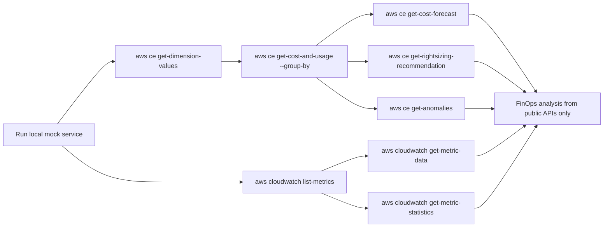

# fix: Restore AWS CLI API interoperability for mock AWS surfaces

## Overview
Restore the public AWS-compatible surface so a FinOps or DevOps workflow can use the mock service strictly through `aws cli` calls against `http://127.0.0.1:8080`, without depending on `/_mock/*` helper endpoints. The immediate goal is to make the already-implemented Cost Explorer and CloudWatch functionality reachable through the target names, request shapes, and discovery APIs that the AWS CLI actually emits.

## Problem Statement
The mock currently has enough seeded data to support useful cost and metric analysis, but the public compatibility layer is incomplete:

- Cost Explorer dispatch accepts both `AWSCostExplorer.*` and `AWSInsightsIndexService.*` prefixes at the router level, but only `GetCostAndUsage` is actually aliased in the operation match. Current CLI calls for `GetDimensionValues` and `GetAnomalies` use `AWSInsightsIndexService.*` and fail as `UnsupportedAction`: [src/serve.rs](../../src/serve.rs#L869), [src/serve.rs](../../src/serve.rs#L1645).
- `GetCostAndUsage` returns `GroupDefinitions` but always leaves `ResultsByTime[0].Groups` empty, which blocks CLI-driven service or resource breakdowns: [src/serve.rs](../../src/serve.rs#L1900).
- CloudWatch supports `GetMetricData` and `GetMetricStatistics`, but not `ListMetrics`, so CLI-only users cannot discover metric namespaces, names, or dimensions from the public surface.
- Capability metadata still advertises only the `AWSCostExplorer.*` target for most CE operations, which does not reflect how the CLI actually talks to the service: [src/serve.rs](../../src/serve.rs#L1248).
- Current tests cover direct handler behavior but do not prove real CLI interoperability for the failing paths.

## Research Consolidation

### Internal Repo Findings
- Target routing treats any `AWSInsightsIndexService.*` request as Cost Explorer traffic, so the main gap is operation-level alias coverage rather than top-level routing: [src/serve.rs](../../src/serve.rs#L869).
- Only `GetCostAndUsage` currently supports the `AWSInsightsIndexService.*` alias in `handle_cost_explorer`; all other CE operations are keyed only on `AWSCostExplorer.*`: [src/serve.rs](../../src/serve.rs#L1645).
- `GetDimensionValues`, `GetCostForecast`, `GetRightsizingRecommendation`, `GetAnomalies`, `GetAnomalyMonitors`, and `GetAnomalySubscriptions` all exist as handlers already; most interoperability work is wiring and contract alignment, not greenfield feature creation: [src/serve.rs](../../src/serve.rs#L1931), [src/serve.rs](../../src/serve.rs#L1986), [src/serve.rs](../../src/serve.rs#L2344), [src/serve.rs](../../src/serve.rs#L2437), [src/serve.rs](../../src/serve.rs#L2488), [src/serve.rs](../../src/serve.rs#L2523).
- Existing route-level tests cover the direct `AWSCostExplorer.GetDimensionValues` target, but there is no alias coverage and no end-to-end CLI proof: [src/serve.rs](../../src/serve.rs#L3094).
- Prior parity planning already identified grouped CE output and CloudWatch `ListMetrics` as important gaps, so this plan should focus on finishing the public contract rather than inventing new APIs: [docs/plans/2026-02-18-test-aws-mock-service-parity-plan.md](2026-02-18-test-aws-mock-service-parity-plan.md), [docs/plans/2026-02-19-test-comprehensive-aws-api-parity-suite-plan.md](2026-02-19-test-comprehensive-aws-api-parity-suite-plan.md).

### Institutional Learnings
- No relevant `docs/solutions/` entries currently exist in this checkout.
- Existing plans consistently treat wire-compatibility, parity tests, and CLI/SDK realism as the primary success metric for this service.

### External Research Decision
This is an external API compatibility fix, so external research is required.

### External Documentation Highlights
- AWS Cost Explorer sample requests use the `AWSInsightsIndexService.*` target namespace, which matches the behavior observed from the installed AWS CLI during local debug runs.
- `GetDimensionValues` documents pagination via `NextPageToken` and filter/search semantics that should remain usable from the CLI.
- `GetCostForecast` requires `Granularity`, so validation should align with the real service model instead of relying on optional local defaults.
- CloudWatch `ListMetrics` is the documented public discovery surface for namespaces, metric names, and dimensions; without it, CLI-only workflows cannot enumerate metrics safely.

## Scope

### In Scope
- [x] Normalize Cost Explorer target dispatch so all already-supported CE operations accept both `AWSCostExplorer.*` and `AWSInsightsIndexService.*`.
- [x] Restore useful CLI output for grouped `GetCostAndUsage` requests, starting with dimensions backed by local data (`SERVICE`, `REGION`, `RESOURCE_ID`).
- [x] Implement CloudWatch `ListMetrics` on the public AWS-compatible surface.
- [x] Align request validation with the CLI/service model where current optional handling causes interoperability drift.
- [x] Add automated proof at two levels:
  - Rust route tests for normalized target dispatch and response shape.
  - AWS CLI smoke verification against a local running server.
- [x] Update public capability metadata so it reflects the real callable targets and operations.

### Out of Scope
- Admin/dashboard auth changes.
- New non-AWS helper endpoints.
- Full SigV4 enforcement.
- Rich FinOps semantics beyond what is needed for CLI reachability.
- New AWS domains beyond Cost Explorer and CloudWatch.

## SpecFlow Analysis

### User Flow Overview
1. Engineer seeds or reuses `mock_data.db` and runs the local mock service.
2. Engineer points `aws cli` at `http://127.0.0.1:8080`.
3. Engineer enumerates available cost dimensions with `ce get-dimension-values`.
4. Engineer breaks spend down with `ce get-cost-and-usage --group-by ...`.
5. Engineer pulls forecast, anomalies, and rightsizing recommendations from CE.
6. Engineer enumerates available metrics with `cloudwatch list-metrics`.
7. Engineer queries CloudWatch metrics with `get-metric-data` or `get-metric-statistics`.
8. Engineer forms a FinOps action list without touching `/_mock/*`.

### Flow Diagram

### Flow Permutations Matrix

| Dimension | Variants |
|---|---|
| Cost Explorer target prefix | `AWSCostExplorer.*`, `AWSInsightsIndexService.*` |
| CE request shape | total-only, grouped, filtered, paginated |
| CE operations | cost, forecast, dimension discovery, commitments, rightsizing, anomalies |
| CloudWatch discovery/query | `ListMetrics`, `GetMetricData`, `GetMetricStatistics` |
| Input quality | valid request, missing required field, invalid token, unsupported dimension |
| Dataset state | baseline, spike, idle-heavy |
| Caller | direct Rust route tests, real `aws cli` smoke |

### Missing Elements and Gaps
- **Protocol aliasing**: implemented handlers exist, but most CE operations are unreachable via the target namespace used by the CLI.
- **Grouped cost output**: cost totals are exposed, but grouped analysis is effectively stubbed.
- **Metric discovery**: metric retrieval exists, but discovery does not.
- **Validation parity**: some handlers are looser than the CLI model and may diverge on required inputs or token semantics.
- **Capability drift**: supported API metadata does not describe the alias target names the CLI actually uses.
- **Verification gap**: no automated check runs real `aws cli` commands against the service.

### Critical Questions Requiring Clarification
1. Important: Should grouped `GetCostAndUsage` support only the dimensions backed by current local data (`SERVICE`, `REGION`, `RESOURCE_ID`) or also return placeholder behavior for unsupported dimensions such as tags?
Resolution: implemented only backed dimensions and kept unsupported keys on the validation path.
2. Important: Should CLI interoperability be gated only against the installed AWS CLI v1/botocore model, or against both v1 and v2 contract shapes?
Resolution: verified against the installed AWS CLI v1/botocore model and normalized CE target aliases at the operation layer.
3. Nice-to-have: Do we want `ListMetrics` parity only for seeded namespaces/dimensions already stored in SQLite, or a broader synthetic catalog?
Resolution: `ListMetrics` derives strictly from seeded metric rows and resource-backed dimensions.

## Technical Approach

### 1. Normalize CE Target Dispatch
- Introduce a small target-normalization layer in `handle_cost_explorer` that maps both `AWSCostExplorer.Operation` and `AWSInsightsIndexService.Operation` to a canonical operation name before matching.
- Keep the handler implementations unchanged where possible; fix dispatch once instead of duplicating match arms for every operation.
- Extend dashboard capability metadata to advertise both target families for CE operations or to explicitly show the canonical operation plus aliases.

### 2. Restore Useful `GetCostAndUsage` Grouping
- Add grouped result building for `SERVICE`, `REGION`, and `RESOURCE_ID` from `cost_records` joined to `resources`.
- Preserve existing total output and add non-empty `Groups` when the caller supplies a supported `GroupBy`.
- Keep grouped output deterministic and scoped to currently seeded data; do not fabricate unsupported dimensions.
- Decide whether pagination is required for grouped output in the first pass. If not, explicitly document the first-pass behavior and leave a bounded follow-up.

### 3. Add CloudWatch `ListMetrics`
- Extend the Query/XML CloudWatch handler to recognize `Action=ListMetrics`.
- Build results from distinct `(namespace, metric_name, dimension set)` combinations in `metrics` and `resources`.
- Support the minimum filter set needed by the CLI:
  - `Namespace`
  - `MetricName`
  - common dimensions such as `InstanceId`
- Return valid XML envelopes so `aws cloudwatch list-metrics` works without custom parsing.

### 4. Tighten Validation and Error Contracts
- Align `GetCostForecast` required-field validation with the CLI model, especially `Granularity`.
- Ensure pagination tokens use consistent validation and error codes across CE handlers.
- Keep unsupported operations returning AWS-style error envelopes, but move currently supported operations out of the `UnsupportedAction` path.

### 5. Add Verification Harnesses
- Expand route tests in [src/serve.rs](../../src/serve.rs) to cover:
  - `AWSInsightsIndexService.GetDimensionValues`
  - `AWSInsightsIndexService.GetAnomalies`
  - grouped `GetCostAndUsage`
  - `ListMetrics` XML response shape
- Add a CLI smoke script or Make target that:
  - starts the service against a seeded DB
  - runs representative `aws ce` and `aws cloudwatch` commands
  - fails fast on `UnsupportedAction`, malformed output, or empty grouped results where data exists

## Acceptance Criteria
- [x] `aws ce get-dimension-values` succeeds against the mock endpoint and returns usable values for `SERVICE`, `REGION`, and `RESOURCE_ID`.
- [x] `aws ce get-cost-and-usage --group-by Type=DIMENSION,Key=SERVICE` returns at least one populated group when seeded cost data exists.
- [x] `aws ce get-cost-forecast --granularity DAILY ...` succeeds through the public CLI surface.
- [x] `aws ce get-rightsizing-recommendation` succeeds through the public CLI surface.
- [x] `aws ce get-anomalies` succeeds through the public CLI surface.
- [x] `aws ce get-anomaly-monitors` and `aws ce get-anomaly-subscriptions` succeed through the public CLI surface.
- [x] All implemented CE handlers accept both `AWSCostExplorer.*` and `AWSInsightsIndexService.*` target prefixes.
- [x] `aws cloudwatch list-metrics` succeeds and returns seeded metrics discoverable by namespace and name.
- [x] Existing `aws cloudwatch get-metric-data` and `get-metric-statistics` behavior remains intact.
- [x] Supported API metadata reflects the real callable target names and discovery operations.
- [x] Automated Rust tests cover alias dispatch, grouped CE output, and `ListMetrics`.
- [x] A reproducible CLI smoke check passes locally.

## Implementation Phases

### Phase 1: Target Alias Closure
- [x] Add canonical CE operation normalization for both target prefixes.
- [x] Update capability metadata to reflect aliases consistently.
- [x] Add route tests for alias reachability on the currently failing CE operations.

### Phase 2: Cost Explorer Analysis Reachability
- [x] Implement grouped `GetCostAndUsage` for seeded dimensions.
- [x] Align `GetCostForecast` and other CE validations with current CLI expectations.
- [x] Add tests for grouped output and validation errors.

### Phase 3: CloudWatch Discovery Reachability
- [x] Implement `ListMetrics` in the Query/XML surface.
- [x] Add tests for filter behavior and XML envelope shape.

### Phase 4: End-to-End CLI Proof
- [x] Add a local CLI smoke workflow or Make target for representative CE and CloudWatch calls.
- [x] Document the exact commands used for verification.
- [x] Re-run the FinOps CLI-only workflow and confirm it no longer depends on `/_mock/*`.

## Execution Notes
- Implemented the CE alias fix by normalizing target prefixes to canonical operation names instead of duplicating match arms per target family.
- Added grouped `GetCostAndUsage` responses for supported dimensions and preserved daily bucket output for CLI-driven grouping.
- Added Query/XML `ListMetrics` based on seeded SQLite metric rows plus resource-backed dimension names.
- Added `scripts/verify_cli_interop.sh` and `make verify-cli-interoperability` to prove the public surface through the real AWS CLI.

## Risks and Mitigations
- **Risk:** aliasing only the target names may still leave the CLI unusable if response shapes are too stubbed.
  - **Mitigation:** pair alias fixes with grouped `GetCostAndUsage` and `ListMetrics`, not just dispatch changes.
- **Risk:** overreaching into full AWS parity could bloat the change.
  - **Mitigation:** limit scope to current seeded dimensions and CLI-reachable workflows.
- **Risk:** CLI behavior may differ across botocore versions.
  - **Mitigation:** normalize to operation names and preserve both CE target families; keep a smoke script in-repo.

## Verification Plan
- `cargo fmt`
- `cargo test`
- `cargo clippy --all-targets --all-features`
- `AWS_ACCESS_KEY_ID=test AWS_SECRET_ACCESS_KEY=test AWS_DEFAULT_REGION=us-east-1 aws --endpoint-url http://127.0.0.1:8080 ce get-dimension-values --time-period Start=2026-03-01,End=2026-03-11 --dimension SERVICE`
- `AWS_ACCESS_KEY_ID=test AWS_SECRET_ACCESS_KEY=test AWS_DEFAULT_REGION=us-east-1 aws --endpoint-url http://127.0.0.1:8080 ce get-cost-and-usage --time-period Start=2026-03-01,End=2026-03-11 --granularity DAILY --metrics UnblendedCost --group-by Type=DIMENSION,Key=SERVICE`
- `AWS_ACCESS_KEY_ID=test AWS_SECRET_ACCESS_KEY=test AWS_DEFAULT_REGION=us-east-1 aws --endpoint-url http://127.0.0.1:8080 ce get-cost-forecast --time-period Start=2026-03-01,End=2026-03-11 --metric UNBLENDED_COST --granularity DAILY`
- `AWS_ACCESS_KEY_ID=test AWS_SECRET_ACCESS_KEY=test AWS_DEFAULT_REGION=us-east-1 aws --endpoint-url http://127.0.0.1:8080 ce get-anomalies --date-interval StartDate=2026-03-01,EndDate=2026-03-11`
- `AWS_ACCESS_KEY_ID=test AWS_SECRET_ACCESS_KEY=test AWS_DEFAULT_REGION=us-east-1 aws --endpoint-url http://127.0.0.1:8080 cloudwatch list-metrics --namespace AWS/EC2`
- `AWS_ACCESS_KEY_ID=test AWS_SECRET_ACCESS_KEY=test AWS_DEFAULT_REGION=us-east-1 aws --endpoint-url http://127.0.0.1:8080 cloudwatch get-metric-data --metric-data-queries file://metric_queries.json --start-time 2026-03-11T00:00:00Z --end-time 2026-03-11T12:00:00Z`

## References
- AWS Cost Explorer `GetCostForecast`: https://docs.aws.amazon.com/aws-cost-management/latest/APIReference/API_GetCostForecast.html
- AWS Cost Explorer `GetDimensionValues`: https://docs.aws.amazon.com/aws-cost-management/latest/APIReference/API_GetDimensionValues.html
- AWS Cost Explorer `GetAnomalies`: https://docs.aws.amazon.com/aws-cost-management/latest/APIReference/API_GetAnomalies.html
- AWS CloudWatch `ListMetrics`: https://docs.aws.amazon.com/AmazonCloudWatch/latest/APIReference/API_ListMetrics.html
