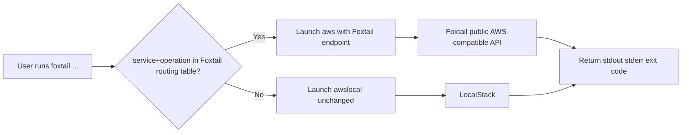

# feat: Add standalone Foxtail CLI wrapper for FinOps-aware AWS routing

## Overview

Add a new standalone CLI tool, tentatively named `foxtail`, that wraps the AWS CLI experience. The wrapper should execute `awslocal` by default so normal LocalStack workflows keep working, but it should automatically route the FinOps-oriented commands already implemented in this repo to the Foxtail mock service endpoint instead.

The goal is to give users one command surface for local AWS workflows:

- non-FinOps or unsupported commands continue to hit LocalStack through `awslocal`
- supported FinOps commands transparently hit Foxtail
- callers do not need to remember which endpoint or target family belongs to which service

## Problem Statement / Motivation

The repo already exposes a meaningful AWS-compatible surface for FinOps workflows, but users must manually switch from `awslocal` or `aws --endpoint-url ...` depending on the command they want to run.

Current friction:

- LocalStack remains the default local target for general AWS workflows.
- Foxtail provides higher-fidelity support for cost, pricing, optimization, tagging, CUR, and CloudWatch metric workflows that LocalStack either does not expose or does not model well.
- The current UX requires humans to know which commands are “Foxtail commands” and to remember the correct endpoint override.
- The compatibility work completed in [docs/plans/2026-03-11-fix-aws-cli-api-interoperability-plan.md](2026-03-11-fix-aws-cli-api-interoperability-plan.md) improved the public API surface, but it still leaves command selection and endpoint targeting on the caller.

This wrapper removes that endpoint-selection burden and makes Foxtail the automatic backend for the FinOps command set the repo already supports.

## Research Consolidation

### Internal Repo Findings

- The current Rust binary exposes only `gen` and `serve`; there is no wrapper tool today: [src/cli.rs](../../src/cli.rs), [src/main.rs](../../src/main.rs).
- The README already documents the supported public AWS-compatible commands and is the clearest current inventory for wrapper routing: [README.md](../../README.md).
- The CLI interoperability smoke script provides a concrete, executable command matrix for the current supported FinOps surface: [scripts/verify_cli_interop.sh](../../scripts/verify_cli_interop.sh).
- The Makefile already treats CLI interoperability as a first-class verification step, which makes it a good place to hang wrapper verification too: [Makefile](../../Makefile).
- The recent interoperability plan established that the public Foxtail surface is now reachable through real AWS CLI commands for Cost Explorer, CloudWatch, Pricing, CUR, Compute Optimizer, and Resource Groups Tagging API: [docs/plans/2026-03-11-fix-aws-cli-api-interoperability-plan.md](2026-03-11-fix-aws-cli-api-interoperability-plan.md).

### Institutional Learnings

- No `docs/brainstorms/` document exists in this checkout for this feature.
- No `docs/solutions/` directory exists in this checkout, so there are no repo-local solution notes to carry forward.
- Existing plans in this repo consistently prefer explicit parity matrices and executable smoke checks over heuristic “it should work” assumptions.

### External Research Decision

Proceeding without external research.

Reasoning:

- The routing problem is primarily repo-local: it depends on the exact AWS-compatible commands Foxtail currently supports.
- The existing README and CLI smoke script already define the effective command contract.
- A wrapper that shells out to `awslocal`/`aws` does not require framework or standards research to produce a safe implementation plan.

## Proposed Solution

Introduce a separate binary that acts as a thin command router and subprocess launcher.

### High-Level Behavior

1. User runs the new wrapper instead of `awslocal`.
2. The wrapper parses enough of the command line to identify the AWS service and operation.
3. If the command matches Foxtail’s supported FinOps command matrix, the wrapper executes the AWS CLI with Foxtail defaults:
   - `--endpoint-url http://127.0.0.1:8080` unless overridden
   - pass through credentials, region, output flags, paging controls, and all remaining arguments
4. If the command does not match the supported FinOps matrix, the wrapper delegates to `awslocal` unchanged.

### Supported Foxtail-Routed Commands

The first version should route only the commands already documented and verified in this repo:

- `ce get-cost-and-usage`
- `ce get-cost-and-usage-with-resources`
- `ce get-cost-forecast`
- `ce get-usage-forecast`
- `ce get-dimension-values`
- `ce get-tags`
- `ce get-reservation-coverage`
- `ce get-reservation-utilization`
- `ce get-savings-plans-coverage`
- `ce get-savings-plans-utilization`
- `ce get-rightsizing-recommendation`
- `ce get-anomalies`
- `ce get-anomaly-monitors`
- `ce get-anomaly-subscriptions`
- `resourcegroupstaggingapi get-resources`
- `resourcegroupstaggingapi get-tag-keys`
- `resourcegroupstaggingapi get-tag-values`
- `pricing get-products`
- `compute-optimizer get-ec2-instance-recommendations`
- `compute-optimizer get-ebs-volume-recommendations`
- `cur describe-report-definitions`
- `cloudwatch list-metrics`
- `cloudwatch get-metric-statistics`
- `cloudwatch get-metric-data`

### Explicit Non-Goals for V1

- Dynamic discovery of Foxtail capabilities from the server at runtime
- Parsing arbitrary AWS CLI models or botocore service definitions
- Supporting every AWS command that happens to hit Foxtail’s `POST /` route
- Replacing `awslocal` entirely
- Managing Foxtail server lifecycle automatically unless explicitly added later

## Technical Considerations

### Packaging Choice

Prefer a new standalone binary in the existing Cargo package rather than a new repository or a shell script.

Likely shape:

- `src/bin/foxtail.rs`
- `src/wrapper.rs` or `src/bin/shared/wrapper.rs`
- optional test fixtures under `tests/`

Why:

- keeps release/build flow inside the current Rust package
- allows typed argument parsing where useful
- makes subprocess and exit-code handling testable
- avoids brittle shell quoting edge cases

### Command Parsing Strategy

The wrapper should not try to fully reimplement AWS CLI parsing. It only needs to classify commands safely.

Recommended strategy:

- preserve the original argv for subprocess execution
- identify the first non-global token as service
- identify the next non-flag token as operation
- treat help/version passthrough specially
- keep classification table-driven with exact `(service, operation)` pairs

This avoids deep coupling to AWS CLI internals while still making routing deterministic.

### Backend Selection Rules

Use a simple explicit routing matrix:

- if `(service, operation)` is in the Foxtail support table, invoke `aws` with Foxtail endpoint defaults
- otherwise invoke `awslocal`

Do not attempt to call `awslocal` and then retry against Foxtail on failure. That would hide contract problems and produce ambiguous behavior.

### Endpoint and Binary Resolution

The wrapper should support environment- and flag-based overrides without changing the default behavior.

Recommended defaults:

- Foxtail endpoint default: `http://127.0.0.1:8080`
- Foxtail endpoint env override: `FOXTAIL_ENDPOINT_URL`
- awslocal binary override: `FOXTAIL_AWSLOCAL_BIN`
- aws binary override: `FOXTAIL_AWS_BIN`

Recommended precedence:

1. explicit wrapper-only override flags
2. wrapper-specific env vars
3. built-in defaults

The wrapper should not silently inject a Foxtail endpoint if the caller already provided `--endpoint-url`; instead it should either:

- respect the explicit user endpoint, or
- fail with a clear message if explicit endpoint conflicts with forced Foxtail routing

The safer V1 behavior is to respect explicit user input and log/debug-note only when verbose mode is enabled.

### UX and Debuggability

The tool should make routing visible when needed without adding noise to normal command output.

Recommended wrapper flags:

- `--debug-routing`: print which backend was selected and the effective command
- `--foxtail-endpoint <url>`: override Foxtail endpoint for routed commands
- `--awslocal-bin <path>`: override awslocal executable
- `--aws-bin <path>`: override aws executable

Everything after a `--` separator should be forwarded untouched.

### Verification Surface

The wrapper needs stronger verification than a pure unit-test approach because the core value is subprocess behavior.

Recommended verification layers:

- unit tests for routing classification
- integration tests for subprocess argument construction using stub executables
- smoke script that verifies real delegation behavior with installed `awslocal`/`aws`

## System-Wide Impact

- **Interaction graph**: wrapper CLI decides backend, then launches either `awslocal` or `aws --endpoint-url <foxtail>`, which then calls either LocalStack or Foxtail’s public AWS-compatible surface.
- **Error propagation**: subprocess exit codes and stderr must pass through unchanged so users still see authentic AWS CLI failures.
- **State lifecycle risks**: routing the wrong command to Foxtail could create confusing “unsupported” errors; routing the wrong command to LocalStack could silently bypass Foxtail fidelity. Exact command matching is therefore part of the core correctness contract.
- **API surface parity**: the wrapper command matrix must stay aligned with [README.md](../../README.md) and [scripts/verify_cli_interop.sh](../../scripts/verify_cli_interop.sh), otherwise docs and runtime behavior will drift.
- **Integration test scenarios**: real subprocess checks must cover both routed and passthrough paths, explicit endpoint overrides, and exit-code propagation.

## SpecFlow Analysis

### User Flow

1. Developer starts LocalStack as usual.
2. Developer starts Foxtail with seeded data.
3. Developer runs the new wrapper command instead of `awslocal`.
4. Wrapper routes standard AWS commands to LocalStack by default.
5. Wrapper routes supported FinOps commands to Foxtail automatically.
6. Developer gets AWS CLI-shaped output without manually choosing endpoints.

### Flow Diagram

### Flow Permutations Matrix

| Dimension | Variants |
| --- | --- |
| Backend | `awslocal`, `aws --endpoint-url <foxtail>` |
| Command class | supported FinOps, unsupported/non-FinOps, wrapper help/version |
| Endpoint source | default, wrapper flag override, env override, explicit AWS CLI endpoint |
| Failure mode | missing binary, Foxtail unavailable, LocalStack unavailable, unsupported command |
| Output behavior | normal stdout passthrough, stderr passthrough, exit code passthrough |

### Gaps and Edge Cases To Cover

- commands with global AWS flags before the service token
- `help` and `--version` flows
- explicit user-provided `--endpoint-url`
- profile/region/output flags passed before or after service/operation
- command aliases that may include uppercase/lowercase differences should be normalized conservatively
- future supported Foxtail operations should require one routing-table update, not parser rewrites

## Implementation Phases

### Phase 1: Define Command Contract

- [x] Create routing inventory doc or code table from [README.md](../../README.md) and [scripts/verify_cli_interop.sh](../../scripts/verify_cli_interop.sh)
- [x] Decide final binary name and help text in `src/bin/foxtail.rs`
- [x] Define wrapper-only flags and environment-variable precedence
- [x] Document unsupported/ambiguous cases explicitly in [README.md](../../README.md)

### Phase 2: Implement Routing Core

- [x] Add subprocess launcher module, for example `src/wrapper.rs`
- [x] Add exact `(service, operation)` routing table
- [x] Add argv classifier that preserves original argument order for execution
- [x] Add backend selection and command construction for `awslocal` vs Foxtail-routed `aws`
- [x] Ensure stdout, stderr, and exit code are passed through unchanged

### Phase 3: Verify and Harden

- [x] Add unit tests for command classification
- [x] Add integration tests using fake `awslocal` and `aws` executables to assert actual argv received
- [x] Extend CLI smoke tooling with a wrapper verification script, for example `scripts/verify_wrapper_routing.sh`
- [x] Add Make target for wrapper verification
- [x] Update docs with example commands for both routed and passthrough paths

## Acceptance Criteria

- [x] A new standalone binary exists and is documented as the preferred local wrapper for mixed LocalStack + Foxtail workflows.
- [x] Unsupported or non-FinOps commands are delegated to `awslocal` by default.
- [x] All currently supported Foxtail FinOps commands listed in this plan are delegated to the Foxtail endpoint instead of LocalStack.
- [x] The routing decision is based on explicit `(service, operation)` matching, not failure-driven fallback.
- [x] The wrapper preserves caller-provided AWS CLI arguments other than the endpoint defaults it intentionally manages.
- [x] Subprocess stdout, stderr, and exit codes pass through unchanged.
- [x] Wrapper help documents which command families are routed to Foxtail.
- [x] Automated tests cover at least one routed CE command, one routed CloudWatch command, one routed non-CE FinOps command, and one passthrough command.
- [x] Verification scripts prove the wrapper uses Foxtail for supported FinOps commands and `awslocal` for everything else.

## Execution Notes

- Added `src/lib.rs`, `src/wrapper.rs`, and `src/bin/foxtail.rs` to provide a new standalone wrapper binary without disturbing the existing `aws-mock-data-service` CLI.
- Implemented a table-driven routing matrix for the currently supported FinOps command set and a shallow AWS CLI classifier that skips common global flags before identifying `service` and `operation`.
- Added `tests/foxtail_wrapper.rs` with subprocess-backed integration checks using fake `aws` and `awslocal` executables.
- Added `scripts/verify_wrapper_routing.sh` and `make verify-wrapper-routing` for repeatable end-to-end routing verification.
- Updated [README.md](../../README.md) to document the wrapper command surface, wrapper-specific flags, and the routed command matrix.

## Verification

- `cargo fmt --all`
- `cargo test`
- `cargo clippy --all-targets --all-features`
- `bash scripts/verify_wrapper_routing.sh`

## Success Metrics

- Users can run one local command surface instead of manually choosing `awslocal` vs `aws --endpoint-url ...`.
- Supported FinOps workflows documented in the repo execute successfully through the wrapper with zero manual endpoint selection.
- Wrapper regressions are caught by routing tests before they show up as confusing local environment bugs.

## Dependencies & Risks

### Dependencies

- installed `awslocal`
- installed `aws`
- running LocalStack for passthrough commands
- running Foxtail server for routed commands
- a current routing matrix derived from repo-supported public APIs

### Risks

- **Binary ambiguity**: users may confuse the wrapper with the existing `aws-mock-data-service` binary.
  - Mitigation: choose a clearly different name and document both roles.
- **Routing drift**: new supported Foxtail APIs could be added without updating the wrapper.
  - Mitigation: keep routing inventory centralized and reuse it in tests/docs.
- **Argument parsing bugs**: partial parsing can break unusual AWS CLI command forms.
  - Mitigation: keep parsing shallow, table-driven, and heavily fixture-tested.
- **Endpoint override confusion**: explicit user `--endpoint-url` values can conflict with wrapper behavior.
  - Mitigation: define precedence clearly and test it.
- **Missing local binaries**: environments may have `aws` but not `awslocal`, or vice versa.
  - Mitigation: fail early with actionable error messages naming the missing executable.

## Alternative Approaches Considered

### 1. Add another subcommand to `aws-mock-data-service`

Rejected.

The user clarified that this should be a new CLI tool, not another service-management subcommand. Mixing service administration (`gen`, `serve`) with AWS command passthrough also weakens the mental model.

### 2. Use a shell script instead of a Rust binary

Rejected.

This would be faster initially, but quoting, argument forwarding, subprocess tests, and cross-platform behavior would all become more brittle.

### 3. Route by service only instead of `(service, operation)`

Rejected.

This is too broad. For example, `cloudwatch` contains both currently supported and potentially unsupported commands. Routing by exact operation keeps failures legible and minimizes surprise.

## Sources & References

- Current binary CLI surface: [src/cli.rs](../../src/cli.rs)
- Binary entrypoint: [src/main.rs](../../src/main.rs)
- Supported public AWS-compatible command inventory: [README.md](../../README.md)
- Executable interoperability matrix: [scripts/verify_cli_interop.sh](../../scripts/verify_cli_interop.sh)
- Existing local developer task surface: [Makefile](../../Makefile)
- Prior CLI interoperability plan: [docs/plans/2026-03-11-fix-aws-cli-api-interoperability-plan.md](2026-03-11-fix-aws-cli-api-interoperability-plan.md)
